# Assignment 2 SupaCal

20932780 Zhang Hexiao

## System Overview

SupaCal is a simple Java calendar application, which provides users with functionalities including date lookup, contact management, and appointment management. Users can create, modify and delete contacts, recording their mobile numbers and addresses. Users can also manage appointments for any specific date, recording information such as time, location, and relevant contacts. The program will store contacts and appointment information for future use. 

## Activity Diagram


## Major Actors

| Actor             | Responsibility                                               | Information Need                                             |
| ----------------- | ------------------------------------------------------------ | ------------------------------------------------------------ |
| User              | The User should provide a name, phone numbers and addresses for each contact, and a start time, an end time, a location and associated contact for each appointment on a specific date. | The User relies on the system to store contacts and appointments.  The correctness of the input also needs to be verified.  User should be reminded that there are appointments on certain days. |
| Management System | The Management System should be able to verify the correctness of the contact and appointments entered by the User, store these entries, accept changes and deletions to them, and remind the User of appointments. | The Management System needs the User to provide information about contacts and appointments. |

## Use Case Diagram


## Use Case Description

##### Create a Contact

| Purpose        | Allow the User to create a contact.                          |
| -------------- | ------------------------------------------------------------ |
| Actor          | User, Management System                                      |
| Preconditions  | -                                                            |
| Flow of Events | 1. The User invokes the use case by clicking at "Add New Contact"  button in the Contact Management interface. 2. The system enables the User to input. 3. The User provides the information of the new contact and click "Submit". 4. The system checks the validity of the input data. If valid, the new contact will be added to the contact list. 5. The use case instance terminates. |
| Exception      | In step 4, the input can be invalid, in which case we goes back to step 3. In step 3, the User can quit by clicking "Cancel". |
| Postcondition  | The new contact will be stored if valid. The User can select and manage it. |

##### Edit a Contact

| Purpose        | Allow the User to edit an existing contact.                  |
| -------------- | ------------------------------------------------------------ |
| Actor          | User, Management System                                      |
| Preconditions  | The contact has been created.                                |
| Flow of Events | 1. The User invokes the use case by selecting a contact from the contact list and clicking "Edit Selected Contact" in the Contact Management interface. 2. The system enables the User to edit.  3. The User changes the information of the contact and click "Submit".  4. The system checks the validity of the input data. If valid, the contact will be updated.  5. The use case instance terminates. |
| Exception      | In step 4, the input can be invalid, in which case we goes back to step 3. |
| Postcondition  | The contact will be updated if valid.                        |

##### Delete a Contact

| Purpose        | Allow the User to delete an existing contact.                |
| -------------- | ------------------------------------------------------------ |
| Actor          | User, Management System                                      |
| Preconditions  | The contact has been created successfully.                   |
| Flow of Events | 1. The User invokes the use case by selecting a contact from the contact list and clicking "Delete Selected Contact" in the Contact Management interface.   2. The system deletes the selected item.  3. The use case instance terminates. |
| Exception      | In step 2, if no entry is selected, then no operation will occurs. |
| Postcondition  | The contact will be deleted.                                 |

##### Date Lookup

| Purpose        | Allow the User to find out any specific date.                |
| -------------- | ------------------------------------------------------------ |
| Actor          | User, Management System                                      |
| Flow of Events | 1. The User invokes the use case by switching the year and month of the calendar to find a specific date. Dates that have appointments will be marked. 2. The use case instance terminates. |

##### Create an Appointment

| Purpose        | Allow the User to create an appointment for certain date.    |
| -------------- | ------------------------------------------------------------ |
| Actor          | User, Management System                                      |
| Preconditions  | The contact list should be provided.                         |
| Flow of Events | 1. The User invokes the use case by selecting a specific day in the calender. The system will change to the Appointment Management interface. 2. The User clicks "New Appointment" button.  3. The system enables the User to input. 4. The User provides the information of the new appointment and click "Submit". 5. The system checks the validity of the input data. If valid, the new appointment will be added. 6. The use case instance terminates. |
| Exception      | In step 5, the input can be invalid, in which case we goes back to step 4. In step 4, the User can quit by clicking "Cancel". |
| Postcondition  | The appointment will be created and stored if valid. The User can manage it. |

##### Edit an Appointment

| Purpose        | Allow the User to edit an existing appointment.              |
| -------------- | ------------------------------------------------------------ |
| Actor          | User, Management System                                      |
| Preconditions  | The contact list should be provided. The appointment has been created successfully. |
| Flow of Events | 1. The User invokes the use case by selecting a specific day in the Calender. The system will change to the Appointment Management interface.  2. The User selects an appointment from the list and clicks "Edit Appointment" button.  3. The system enables the User to edit.  4. The User edits the information of the new appointment and click "Submit".  5. The system checks the validity of the input data. If valid, the appointment will be updated. 6. The use case instance terminates. |
| Exception      | In step 5, the input can be invalid, in which case we goes back to step 4. |
| Postcondition  | The appointment will be updated if valid.                    |

##### Delete an Appointment

| Purpose        | Allow the User to delete an existing appointment.            |
| -------------- | ------------------------------------------------------------ |
| Actor          | User, Management System                                      |
| Preconditions  | The appointment has been created successfully.               |
| Flow of Events | 1. The User invokes the use case by selecting a specific day in the Calender. The system will change to the Appointment Management interface.   2. The User selects an appointment from the list and clicks "Delete Appointment" button.  3. The system deletes the selected item.  4. The use case instance terminates. |
| Exception      | In step 3, if no entry is selected, then no operation will occur. |
| Postcondition  | The appointment will be deleted.                             |

## Class Diagram

The getter and setter functions for private fields are omitted. Fields related to UI components are also omitted.

## Sequence Diagram

##### Create a Contact

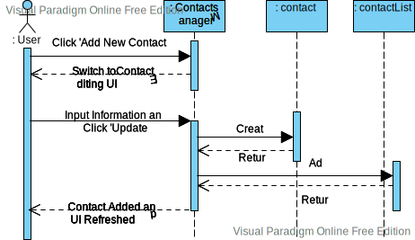

##### Edit a Contact

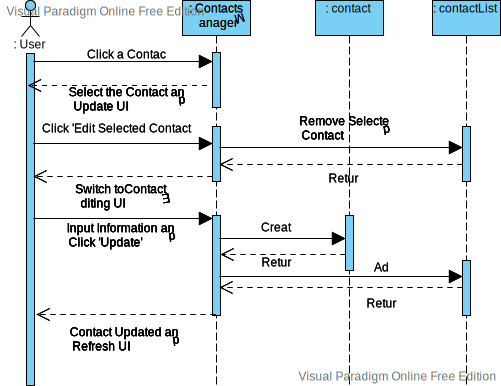

##### Delete a Contact

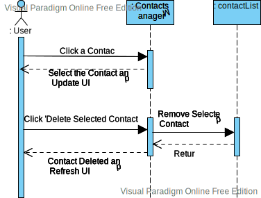

##### Date Lookup

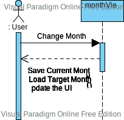

##### Create an Appointment

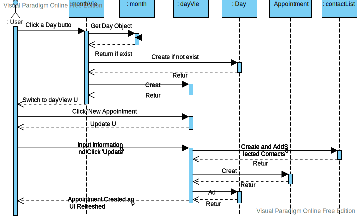

##### Edit an Appointment

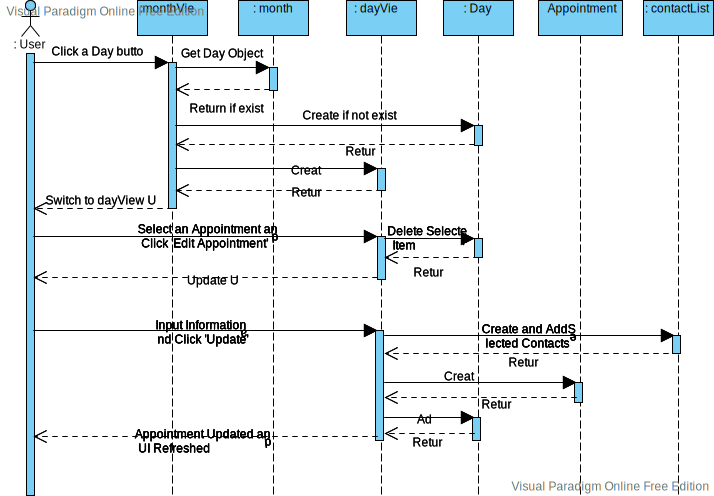

##### Delete an Appointment

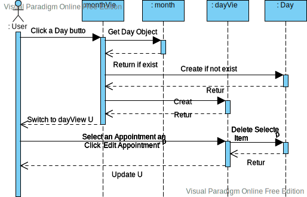

## Limitations

This program doesn't have too many functions and is more like a toy model compared to those powerful popular calendar applications. Users often want the calendar to provide more useful features, such as local weather, holidays and so on.

There is a flaw in the workflow. When modifying contacts and appointments, there is no option to cancel. If the user wants to go back to the state before the modification when editing, he has to do it manually. This is because the selected item is deleted before each edit, and then reinserted after the edit. This implementation is not reasonable.

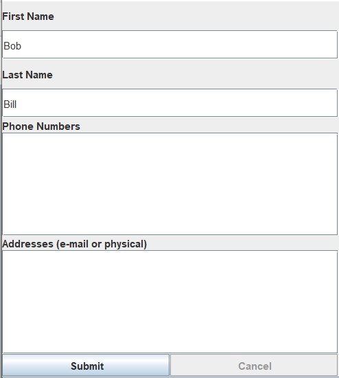

The mark for dates with appointments is not eye-catching enough. We had better revise the UI design.

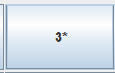

With the current implementation, you need to read and write to disk to access the appointment information after each switch month. This is also unsatisfactory. We should design a class to store all appointments, and read and write its object when the program starts and exits.

The naming style of the code is also inconsistent. The first letter for each class names should be capitalized.
