# Reading Report on Towards Boosting Patch Execution On-the-Fly, ICSE 2022

20932780 ZhangHexiao

## Citation

Samuel Benton, Yuntong Xie, Lan Lu, Mengshi Zhang, Xia Li, Lingming Zhang:
Towards Boosting Patch Execution On-the-Fly. ICSE 2022: 2165-2176

## Abstract

Automated program repairs usually spend a lot of time on patch validation. Given this, the paper proposes a novel automatic program repair (APR) approach, SeAPR, which uses information from earlier patch executions during APR to enhance existing APR tools on the fly. The basic idea is that if a validated patch can make an original originally failed test pass, then it is of high quality. If another patch shares the same modification of program elements (e.g., methods) with high-quality patches, then it is more likely to be plausible and should have a higher priority. Conversely, a larger overlap with a lower-quality patch should result in a lower priority. Information about the overlap of program elements modified by different patches can be quickly computed. Since it relies only on this information, the method is compatible with a wide range of APR tools and can utilize multiple of them at the same time. The technique was evaluated on the Defects4J Dataset with 13 different APR tools. Experiments show that SeAPR typically leads to a significant reduction in the number of patch executions until the first reasonable patch and the first correct patch are found. The method is also robust to the use of different prioritization formulas and partial versus full patch validation. Additional information from the template-based repair tools can improve performance.

## Key Problem

Program repair tools are usually structured in four phases: fault localization, patch generation, patch validation, and manual inspection of the plausible patches. Patch validation is typically the most time-consuming for large projects. If the more promising patches can be filtered and prioritized for validation, the overall time consumption can be reduced greatly.

This paper focuses on how to select the next patch to be validated based on the execution results of previous patches and the degree of similarity between patches.

#### INPUT

The patch validation matrix, which records the validation results of test cases against validated patch candidates, and the patch modification matrix, which records all methods modified within each patch.

#### OUTPUT

Priority values for unverified patches.

## Why accepted?

**Significance**: The paper proposes a simple yet elegant technique that can reduce the running time of the APR process. It focuses on a new perspective in APR technology research and can be applied to a wide range of pre-existing APR tools, complementing rather than replacing them. The results of the experiment are impressive, demonstrating that SeAPR can advance the state-of-the-art of APR, regarding effectiveness and efficiency. Many variations are possible, which can be explored further in future work.

**Novelty**: The idea of using earlier patch execution information during APR to directly boost existing APR techniques themselves on-the-fly is quite novel. According to the paper, it is the first to leverage on-the-fly patch execution information to help better prioritize patch executions and orthogonal to all existing patch prioritization techniques.

**Presentation**: The paper is well-written. There are many examples, figures, and tables supporting the goals and the results of the paper. The technique is explained in great detail, and the evaluation is comprehensive. The main points are presented clearly and are easy to follow. Furthermore, it sufficiently organizes the Related Work and explains the intuitions behind the techniques used (at the end of Section 2.1).

## Summary

This section summarizes the flow and multiple variants of the SeAPR algorithm, corresponding to Chapter 3 of the paper.

#### Definitions of Input

The **patch validation matrix** $M_v$ records the validation results of test cases against patch candidates. In the matrix, each element describes the validation result of test t against patch p. Possible values are as follows: (1) - if t remains unvalidated, (2) × if t fails on p, and (3) ✓ if t passes on p.

Ideally, the patch validation matrix should be **full**, i.e., each element should be either ✓ or ×. However, in practice, most modern APR tools terminate the test execution of a patch as soon as they observe a test failure for that patch to find the correct patch faster. In this case, we say that the patch validation matrix is **partial**.

Table 1 lists examples of full/partial matrices for four example patches (p1, p2, p3, and p4) on 3 test cases (𝑡1, 𝑡2, and 𝑡3) for the full/partial matrix. The first row of the patch verification matrix is the test execution result of the original buggy program (pb).

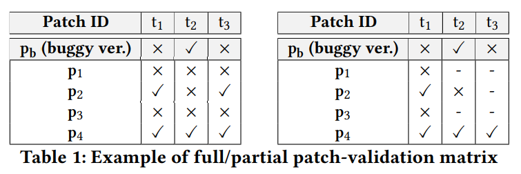

The **patch modification matrix** $M_m$ records all program elements modified within each patch. Each cell describes if patch p modifies element e. Acceptable values for each cell are as follows: (1) ✓ if p modifies element e and (2) - if p does not modify element e. Table 2 is an example.

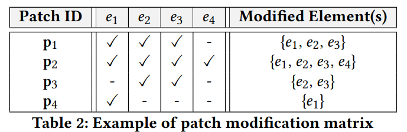

The type of element selected by SeAPR is the method. That is, if patch p modifies method e, then the corresponding element in the patch modification matrix will be √.

#### Patch Quality

If a patch can pass the original failed test, then it is of high quality. Otherwise, it is low quality. For example, in table 1, patches p2 and p4 are high-quality since they can pass test cases t1 and t3 where the original program fails.

The set of high-quality patches $P_H$ and $P_l$ and defined as follows.

  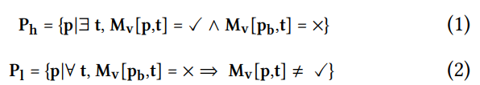

#### Patch Similarity and Prioritization

The similarity between two patches is defined as the number of methods they modify both. The dissimilarity of two patches is defined as the number of methods that are modified by one and not by the other. 

SeAPR prioritizes pending patches by considering how similar they are to all high-quality patches versus low-quality patches. The formal definition is as follows. $M_m[p]$ is the set of methods that are modified by patch p. $s_h$ is the sum of the similarity of p to all high-quality patches, while $s_l$ is that to all low-quality patches. $d_h$ and $d_l$ are the sum of the similarity or dissimilarity of p to all high-quality or low-quality patches, respectively.

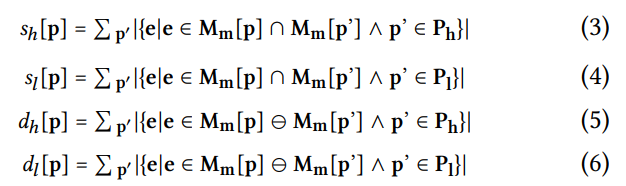

The higher $s_h[p]$ is, the higher priority patch p should have. Based on this idea, the priority value of p is calculated as follows. The form of this formula was inspired by the Ochiai function in fault localization ranking functions of APR.

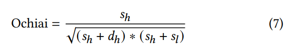 

#### SeAPR Algorithm

The SeAPR algorithm is given as follows. The workflow is quite simple. In each round, SeAPR takes out the unverified patch with the highest priority, validates it, and determines its quality. Accordingly, we update the $(sh,sl,dh,dl) $ tuples for all unverified patches and their priority values.

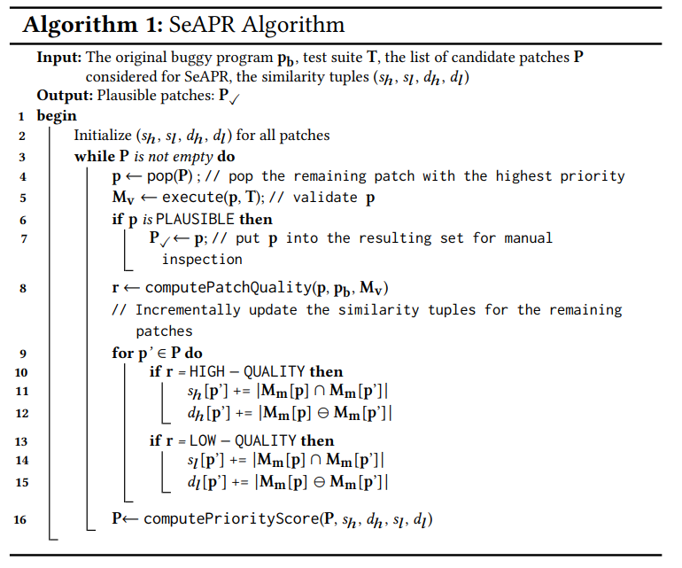

Notice that patches that modify the same methods always have the same similarity values. By clustering patches accordingly, we do not need to iterate through all patches when updating the similarity values, but only through each cluster. Let n denote the number of patches and m denote the number of clusters. The running time of SeAPR is O(mn), while typically m is very small.

#### SeAPR Variants

Based on the basic SeAPR algorithm, certain details are able to be tuned. Their impact will be tested in the experiments.

**Patch-Prioritization Formulae**: there are many other patch-prioritization formulae other than Ochiai.

**Validation-Matrix Types**: Partial or full.

**Patch repair pattern Information**: In the template-based APR tool, patches can be generated with certain patterns. SeAPR can calculate the similarity between patches based on shared patterns as a complement to shared modifications.

**Leveraging APR Results from Other Tools**: the execution results of other APR tools on the same program can be used to boost the current APR tool under SeAPR. Specifically, the previous patch validation matrix and path modification matrix can be taken into account when calculating patch priority.

**The Number of Top Methods Considered**: APR tools will rank suspicious methods during the bug location phase, prioritizing the top-ranked methods for patch generation. When calculating the similarity scores, SeAPR will only consider the top part of the ranked methods, which will increase efficiency.

## Evaluation

This section summarizes the experiments, corresponding to Chapter 4 of the paper.

#### Experiment settings

SeAPR is evaluated on the Defects4J (V1.2.0) dataset, cooperating with 13 different APR tools. The test data is divided into six subjects.

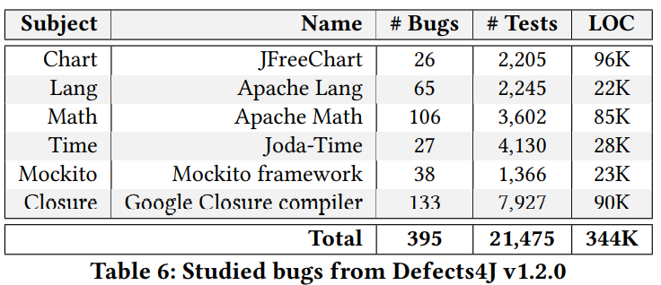

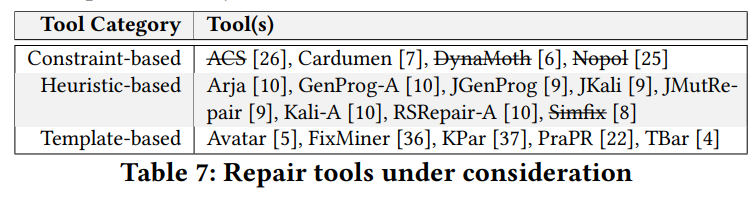

The evaluation metrics include the reduction in the number of patch executions before finding the first plausible patch and the first correct path.

In the experiment, under the time limit set in the original paper, we first analyze the execution of each tool for each subject to obtain the original patch execution ordering and the position of the first plausible/correct patch. Then we repeat the patch validation process for each tool again with the SeAPR algorithm. When calculating patch similarity based on patch modification information, SeAPR will only be applied to patches belonging to Top-30 methods by default, as most APR tools only generate patches for them. By default, the experiment uses the partial validation matrix.

#### Experiment Results

**RQ1: How does the default SeAPR perform on state-of-the-art APR systems? **

Table 8 shows the reduction in terms of the first plausible patches and Table 9 shows the reduction of the first correct patches. Since only some of papers of APR tools provide the location of the correct patch, we will only consider them.

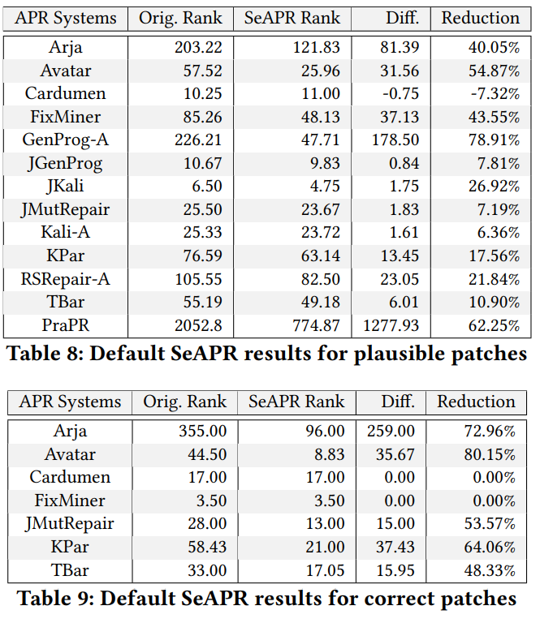

SeAPR substantially reduced patch executions before finding the first plausible/correct patches for almost all studied ARP tools, with a maximum improvement of 78.91% (plausible) / 80.15% (correct). Only for Cardumen, SeAPR does not seem to work, probably because the tool generates too few patches.

**RQ2: Impact of Different Formulae**

The effects of different priority formulas on the experimental results are as follows. The performance of taking different formulas is roughly consistent, demonstrating the great robustness of SeAPR.

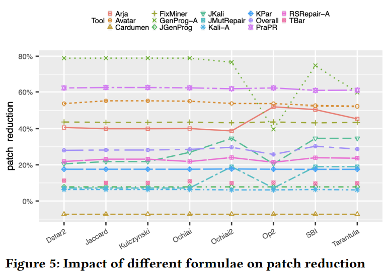

**RQ3: Impact of Full Validation Matrix**

The effects of using a full validation matrix on the experimental results are as follows. 

There is a decrease in the effectiveness of SeAPR on some datasets when the full validation matrix is adopted. It can be seen that the partial validation matrix works better. 

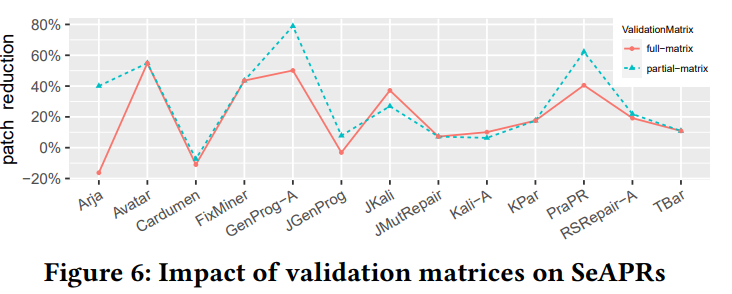

**RQ4: Impact of Additional Patch Pattern Information**

The inclusion of additional pattern information in the similarity calculation significantly improves the performance of SeAPR on the template-based APR tools by up to 29.75%. Furthermore, SeAPR with only patch pattern information can also achieve competitive patch reduction.

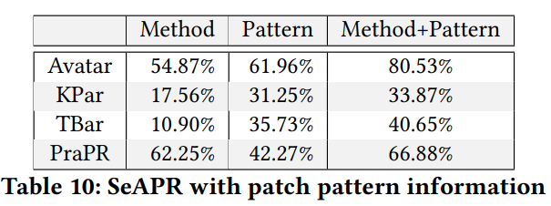

**RQ5: Boosting SeAPR via Other APR Tools**

In this experiment, all patch execution results from other tools are used to initialize the calculation of priority. The results are given as follows.

This additional historical information can further improve SeAPR performance by an average of 18.98 pp and up to 60.53 pp compared to the default configuration of SeAPR.

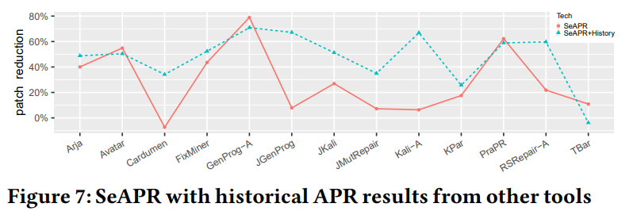   

**RQ6: Impact of Top Methods Considered**

Figure 8 shows the experimental results for applying SeAPR to Top 10 to Top 100 methods (with an interval of 10). According to the figure, the reduction rates increase dramatically for almost all APR systems when increasing the number of top methods from 10 to 20, and they will become stable when SeAPR is applied beyond Top 20 methods.

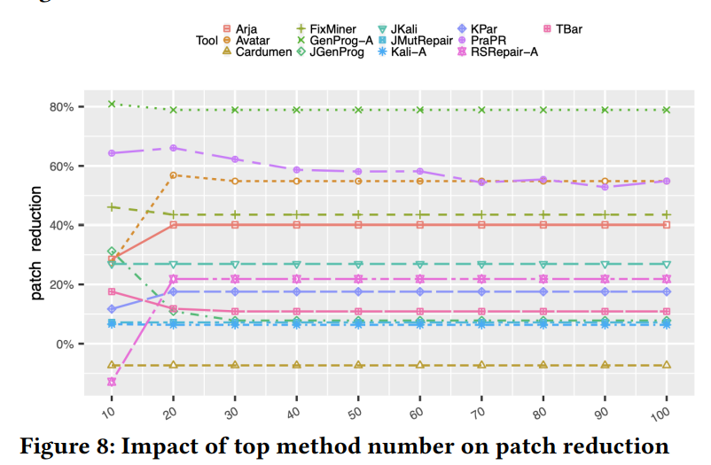

#### More Discussions

**SeAPR Overhead**: the average overhead for running SeAPR on each buggy version never exceeds 2s for any of the APR tools studied, which is negligible since APR tools often take hours to fix a bug.

**Nondeterminism in APR Tools**: RSRepair-A and Kali-A are non-deterministic. For these two tools, the experiment was repeated five times. The average reduction is 23.68%/4.88%, which is similar to the results in Table 8. 

## Reflection

Based on simple ideas, SeAPR effectively improves the efficiency of state-of-the-art APR tools and demonstrates good robustness under different settings. The problem studied in this paper is unique in focusing on the patch verification phase, which makes it well-compatible with various existing APR tools. In this paper, a high-quality patch is defined as a patch that enables an originally failed test case to pass. Note that such patches may fail on an originally successful test case. This design increases the number of high-quality patches. I think it helps priorities to work.

In this paper, the treatment of patch similarity is very simple. Experiments also show that increasing the information considered in the similarity calculation can effectively improve performance. Therefore, I believe that handling similarity at a finer granularity is a promising research direction.

