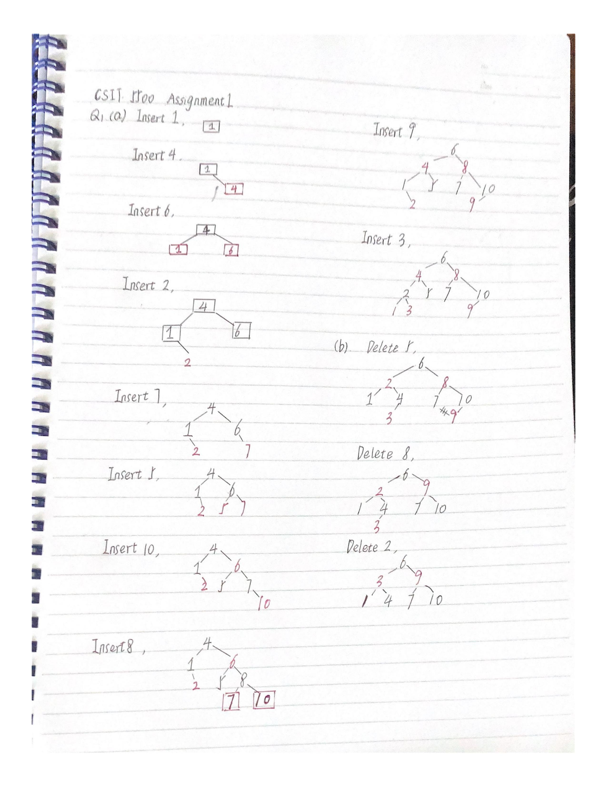

# Written Assignment 1

20932780 Zhang Hexiao

## Q1



It seems that there is another way to rotate after deleting 5. But the eventual outcome (after deleting 2) remains the same.

## Q2

#### (a)

To generate a permutation of size $k$, we need to

- generate a permutation of size $k-1$;
- append one of the unselected elements to the $k-1$ permutation.

Pseudocode is given as below in Python syntax,

```Python
def gen_permutations(A, K):
	'''
	Input: A[1...n], K
	Output: All permutations ret
	'''
	def gen_recursively(k):
        ret = [] # list of size-k permutations and remaining elements
        if k == 1:
            for element in A:
                remainings = A - element
                append ([element], remainings) to ret
        else:
            for (k_1perm, k_1remainings) in gen_recursively(k-1):
                for element in k_1remainings:
                	kremainings = k_1remainings - element
                    kperm = k_1perm + element
                    append (kperm, kremainings) to ret
        return ret
    
    return [Kperm for (Kperm, _) in gen_recursively(K)]
```

For $A=[3,0,1,4],K=2$, the output of each call of `gen_recursively` is as below,

```
gen_recursively(2)
	gen_recursively(1)
	return [
			([3], [0, 1, 4]),
			([0], [3, 1, 4]),
			([1], [3, 0, 4]),
			([4], [3, 0 ,1])
	]
return [
	([3, 0], ...), ([3, 1], ...), ...
]

gen_permutations([3, 0, 1, 4], 2)
return	[[3, 0], [3, 1], [3, 4], [0, 3], [0, 1], [0, 4],
 		 [1, 3], [1, 0], [1, 4], [4, 3], [4, 0], [4, 1]]
```

#### (b).

Let $T(n, k)$ denote the running time for a certain $n$ and $k$, since $T(n,1)=O(n)$,
$$
\begin{aligned}
T(n,k)&=O(n-k+1)T(n,k-1)=O(\frac{n!}{(n-k)!})
\end{aligned}
$$

## Q3

#### (a)

Noticing that the quick select algorithm can divide the input array into two parts, where elements in one part are less than those in the other part. We can extract the desired elements by dividing multiple times. Pesudocodes as below.

```python
def extract_segment(A, k, i):
    n = len(A)
    quick_select(A, (i - 1) * n // k, 0, n)
    quick_select(A, n / k, (i - 1) *n // k, n)
    return A[(i - 1) * n // k : i * n // k]

def quick_select(A, k, l, r):
    ''' select from [l,r) '''
    pick a pivot form A
	q = partition(A) 	# Same as in quick sort
    if q == k - 1:
        return
    elif q > k - 1:
        quick_select(A, k - q, q + 1, r)
    else:
        quick_select(A, k, l, q)
```

Since the average time complexity of `quick_select` is $T(n)=O(n)$, the entire algorithm also runs in $O(n)$ time. 

#### (b).

Like binary search, run the `quick_select` on a halved array every time.

```python
def get_kquantiles(A, k):
    sublen = len(A) // k
    
    def binary_select(l, r, segcounts):
        if segcounts == 0:
            return
        
        q = segcounts // 2 * sublen
        quick_select(A, q, l, r)
        binary_select(l, q, segcounts // 2)
        binary_select(q, r, segcounts // 2)
        
    binary_select(0, len(A), k)
    return [A[i * sublen] for i in range(k)]
```

Now consider the time complexity. Let $T(n, k)$ denote the running time of `get_kquantiles(A, k)`, where $|A|=n$.
$$
T(n,k)=O(n)+2T(n/2, k/2)\\
T(n, 1)=O(n)\\
T(n,k)=\log k *O(n)=O(n\log k)
$$

## Q4

Split $S$ into two parts, calculate the skyline of each part recursively and then merge them. The key point is how to merge two skylines in $O(n)$ times.

The boundary condition is when the set contains only one rectangle. In this case, we return the left top point to denote the start of the skyline and the right bottom point marking the end of the skyline.

Merge is done by scanning two arrays from left to right. Our strategy is to compare the x-axis positions of the element on both sides and select the smaller one. Also, we record the current height of the skyline, which is the greater one of the two merging skylines. By making sure that the height of the point to be appended is different from that of the last appended one, we can avoid redundant points.

```python
def get_skylines_dc(rects):
    if len(rects) == 0:
        return []
   	if len(rects) == 1:
        return [rects[0].lefttop, rects[0].rightbottom]
    
    mid = len(rects) // 2
    sky_l = get_skylines_dc(rects[:mid])
    sky_r =  get_skylines_dc(rects[mid:])
    return merge(sky_l, sky_r)

def merge(left, right):
    i, j = 0, 0
    lh, rh = 0, 0
    ret = []
    while i < len(left) and j < len(right):
        x = min(left[i].x, right[j].x)
        if left[i].x < right[j].x:
            lh = left[i].h
            i += 1
        elif left[i].x > right[j].x:
            rh = right[j].h
            j += 1
        else: 	# equal
            rh = right[j].h, lh = left[i].h
            i += 1, j += 1
        h = max(lh, rh)
        if ret is empty or ret[-1].h != h:
            append (x, h) to ret
    append the left elements in left or right to ret
    return ret
```

Lastly, we process the result to only include all the points at the top of rectangles.

```python
def get_skyline(rects):
    ret = get_skyline_dc(rects)
    processed = []
    for i in range(len(ret) - 1):
        cur, next = ret[i], ret[i + 1]
        processed.extend([cur, (next.x, cur.h)])
    processed.append(ret[-1])
    return [ele for ele in processed if ele.h != 0]
```

Now consider the time complexity. Let $T(n)$ denote the running time of `get_skyline(A)`,where $|A|=n$.
$$
T(n)=O(n)+2T(n/2),T(1)=O(1)\\
T(n)=O(n\log n)
$$

