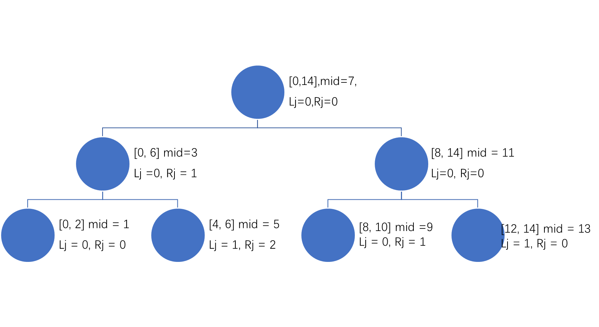

# Written Assignment 2

20932780 Zhang Hexiao

## Q1

#### a

For given input, the steps are as below, noted that repeated cases are omitted.

```
INPUT: pattern P = "abbabbbaabbcab"
q = -1 at the begining, compare P[q + 1] with each char 

a	b	b	a	b	b...
-1	-1	-1
			a	b	b ...	(matched, q += 1)

a	b	b	a	b	b	b	...
-1	-1	-1	0	1	2
    		a	b	b	a	...	(unmatched, q = next[q] = -1)
    					a	...	(unmatched, q = -1)

a	b	b	a	b	b	b	a	a	...
-1	-1	-1	0	1	2	-1
							a	b	b	...	(matched, q += 1)
							
a	b	b	a	b	b	b	a	a	...
-1	-1	-1	0	1	2	-1	0					
							a	b	b	... (unmatched, q = next[q] = -1)
								a	b	... (matched, q += 1)
```

The result is

| a    | b    | b    | a    | b    | b    | b    | a    | a    | b    | b    | c    | a    | b    |
| ---- | ---- | ---- | ---- | ---- | ---- | ---- | ---- | ---- | ---- | ---- | ---- | ---- | ---- |
| -1   | -1   | -1   | 0    | 1    | 2    | -1   | 0    | 0    | 1    | 2    | -1   | 0    | 1    |

#### b

The next table of `bbc`

| char | b    | b    | c    |
| ---- | ---- | ---- | ---- |
| next | -1   | 0    | -1   |

The KMP process:

```
BEGINING:
a	b	b	a	b	b	...
b	b	c

ACCESSING NEXT TABLE:
a	b	b	a	b	b	...
			.
	b	b	c			('a' != 'c', q = 1, next[q] = 0)
		b	b	c		('a' != 'b', q = 0, next[q] = -1)
			b	b	c

a	b	b	a	b	b	b	a	a	...	
						.
				b	b	c			('b' != 'c', q = 1, next[q] = 0)
					b	b	c
					
a	b	b	a	b	b	b	a	a	...	
							.
					b	b	c		('a' != 'c', q = 1, next[q] = 0)
						b	b	c	('a' != 'b', q = 0, next[q] = -1)
							b	b	c	

RESULT:
a	b	b	a	b	b	b	a	a	b	b	c	a	b
									b	b	c
```

## Q2

#### a

Padding character ($) is omited.

Stage 0:

Table rk

| a    | f    | k    | l    | o    | t    |
| ---- | ---- | ---- | ---- | ---- | ---- |
| 0    | 1    | 2    | 3    | 4    | 5    |

Table R

| 0    | 3    | 4    | 5    | 4    | 1    | 2    | 3    | 4    | 2    | 2    | 4    | 2    | 2    | 4    |
| ---- | ---- | ---- | ---- | ---- | ---- | ---- | ---- | ---- | ---- | ---- | ---- | ---- | ---- | ---- |


Stage 1:

Table rk

| al     | fk     | kk     | kl     | ko     | lo     | o     | of     | ok     | ot     | to    |
| ------ | ------ | ------ | ------ | ------ | ------ | ----- | ------ | ------ | ------ | ----- |
| (0, 3) | (1, 2) | (2, 2) | (2, 3) | (2, 4) | (3, 4) | (4, ) | (4, 1) | (4, 2) | (4, 5) | (5,4) |

Table R

| 0    | 5    | 9    | 10   | 7    | 1    | 3    | 5    | 8    | 2    | 4    | 8    | 2    | 4    | 6    |
| ---- | ---- | ---- | ---- | ---- | ---- | ---- | ---- | ---- | ---- | ---- | ---- | ---- | ---- | ---- |

Stage 2:

Table rk

| alot   | fklo   | kko    | kkok   | klok   | ko    | kokk   | lokk   | loto    | o     | ofkl   | okko   | otof   | tofk    |
| ------ | ------ | ------ | ------ | ------ | ----- | ------ | ------ | ------- | ----- | ------ | ------ | ------ | ------- |
| (0, 9) | (1, 5) | (2, 6) | (2, 8) | (3, 8) | (4, ) | (4, 2) | (5, 2) | (5, 10) | (6, ) | (7, 3) | (8, 4) | (9, 7) | (10, 1) |

Table R

| 0    | 8    | 12   | 13   | 10   | 1    | 4    | 7    | 11   | 3    | 6    | 11   | 2    | 5    | 9    |
| ---- | ---- | ---- | ---- | ---- | ---- | ---- | ---- | ---- | ---- | ---- | ---- | ---- | ---- | ---- |

Stage 3:

Table rk

| alotofkl | fklokkok | kko   | kkokko | klokkokk | ko    | kokko  | lokkokko |
| -------- | -------- | ----- | ------ | -------- | ----- | ------ | -------- |
| (0, 10)  | (1, 3)   | (2, ) | (3, 5) | (4, 6)   | (5, ) | (6, 9) | (7, 11)  |

| lotofklo | o     | ofklokko | okko   | okkokko | otofklok | tofklokk |
| -------- | ----- | -------- | ------ | ------- | -------- | -------- |
| (8, 1)   | (9, ) | (10, 11) | (11, ) | (11, 2) | (12, 4)  | (13, 7)  |

Table R

| 0    | 8    | 13   | 14   | 10   | 1    | 4    | 7    | 12   | 3    | 6    | 11   | 2    | 5    | 9    |
| ---- | ---- | ---- | ---- | ---- | ---- | ---- | ---- | ---- | ---- | ---- | ---- | ---- | ---- | ---- |

Stage 4:

Table rk

| substring       | pair     |
| --------------- | -------- |
| alotofklokkokko | (0, 12)  |
| fklokkokko      | (1, 5)   |
| kko             | (2, )    |
| kkokko          | (3, )    |
| klokkokko       | (4, 9)   |
| ko              | (5, )    |
| kokko           | (6, )    |
| lokkokko        | (7, )    |
| lotofklokkokko  | (8, 3)   |
| o               | (9, )    |
| ofklokkokko     | (10, 2)  |
| okko            | (11, )   |
| okkokko         | (12, )   |
| otofklokkokko   | (13, 6)  |
| tofklokkokko    | (14, 11) |

Table R

| 0    | 8    | 13   | 14   | 10   | 1    | 4    | 7    | 12   | 3    | 6    | 11   | 2    | 5    | 9    |
| ---- | ---- | ---- | ---- | ---- | ---- | ---- | ---- | ---- | ---- | ---- | ---- | ---- | ---- | ---- |

### b



## Q3

The problem can be converted to compute the longest common subsequence (LCS).

First, sort `A` in ascending order to get `A_sorted` in $O(n\log n)$ time.

Then remove the duplicated elements in `A_sorted`, which can be done in $O(n)$.

Last, compute the LCS between `A` and `A_sorted`. The result is the corresponding index of LCS in `A`, which is also the maximum increasing subsequence of `A`. LCS runs in $O(n^2)$.

The overall running time is $O(n^2)$.

## Q4

Suppose that we refuel at the stations $i_1,i_2,\cdots,i_k$，the optimal strategy at $i_j$ is

- If $c_{i_j}>c_{i_{j+1}}$, we fill the tank just enough to reach the station $i_{j+1}$.
- Otherwise, we fill up the tank and go to $i_{j+1}$.

Let $C(i,g)$ denote the minimum cost from the station $i$ to the destination $t$, with the amount of fuel at $g$ units when arriving $i$.
$$
C(n,g)=c_n(d_n-g),g\le d_n\\
C(i,g)=\min_{j>i,dist(i,j)\le L}\begin{cases}
C(j,0)+(dist(i,j)-g)c_i, & \text{if}\ c_j <c_i \and g\le dist(i,j)\\
C(j,L-dist(i,j))+(L-g)c_i, &\text{if}\ c_j\ge c_i
\end{cases}
$$
Where $dist(i,j)=\sum_{i}^{j-1}d_i$.

At the station $i$, We only need to calculate the cost for $g\in \{0\}\cup \{L-dist(k,i)|k<i\and dist(k,i)<L\}$.

```python
Init C[-, -] with INF
for i from n to 1:	# O(n)
    # Calculate all possible g for station i
	possible_gs = []
    j = i - 1
    dist = d[j]
    while j >= 0 and dist <= L:
        possible_gs.append(L - dist)
        dist += d[j]
        j -= 1
    if possible_gs[-1] != 0: possible_gs.append(0)
    
    if i == n:
        for g in possible_gs:
            C[n, g] = c[n] * (d[n] - g)
    else:
        # enumerate all reachable j
        j = i + 1
        dist = d[i]
        while j <= n and dist <= L: # O(n)
            for g in possible_gs:	# O(n)
                if c[j] < c[i] and g <= dist:
                    C[i, j] = min(C[i, j], C[j, 0] + (dist - g) * c[i])
                elif c[j] >= c[i]:
                    C[i, j] = min(C[i, j], C[j, L - dist] + (L - g) * C[i])
            j += 1
            dist += d[j-1]
```

The source $s$ is viewed as the station 0 with zero fuel prize. The output is $C(1, L-d_0)$.

Since the number of stations to be enumerated in each loop is $O(n)$, the time complexity of the whole algorithm is $O(n^3)$.


---

The time complexity of dynamic programming is not ideal, and there is a more efficient greedy algorithm, but I don't know how to  relate them.

This greedy algorithm ensures that we always refuel at the lowest possible price. At each gas station,

- Choose the first gas station whose price is lower than the current price. Fill the tank with exactly the amount of fuel that can reach the station, if needed, and go there.
- If there is no such station among the reachable ones, fill up the tank and go to the next station. Repeat the process.

$t$ and $s$ are viewed as gas stations with zero fuel prices.


To select the next station that offers a lower price, we can use the monotone stack. Push the stations from the last to the first to a stack. Each time pop the elements on top of the stack that have higher prices. In this way, the prices in the stack are monotonically decreasing. So in every decision, we can find the next possible target in $O(1)$ time.

```python
for st in reversed(stations):
    while stack is not empty and st.price <= stack.top().price:
        stack.pop()
    if stack is empty:
        st.next_cheaper = -1
    else:
        st.next_cheaper = stack.top()
    stack.push(st)
```

The overall time complexity is $O(n)$.