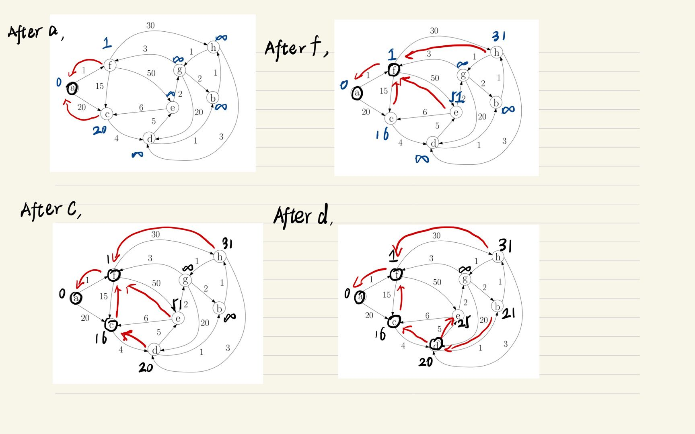
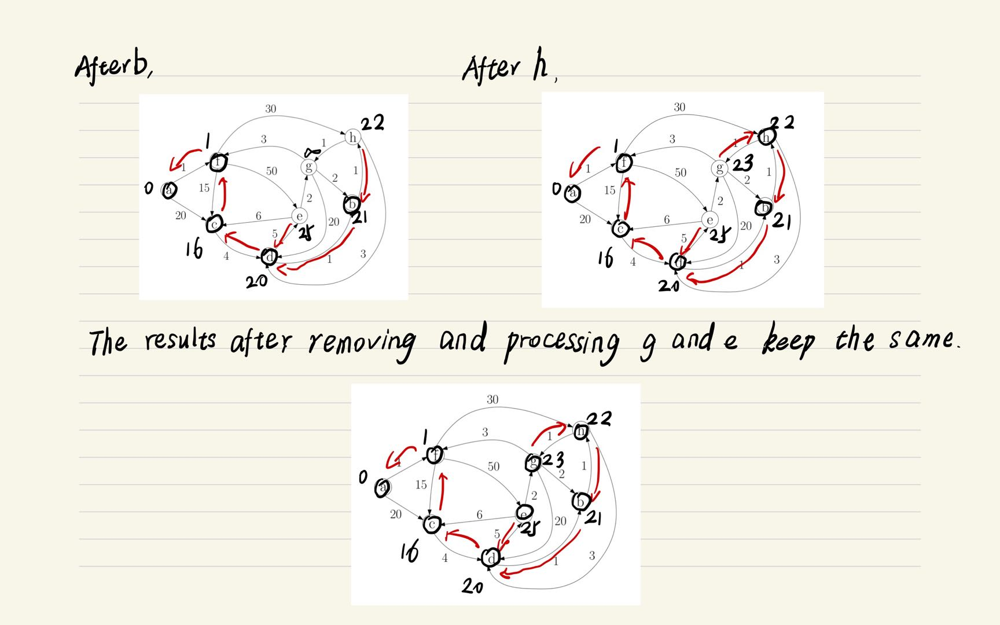
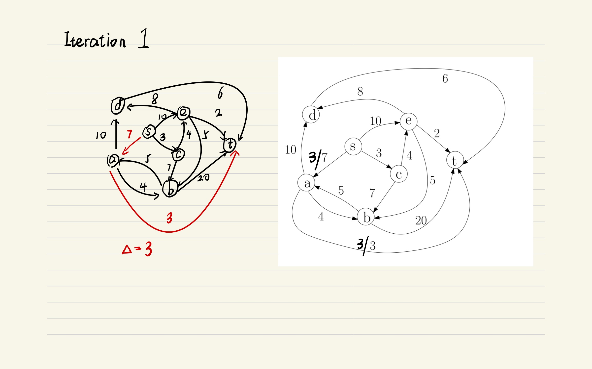
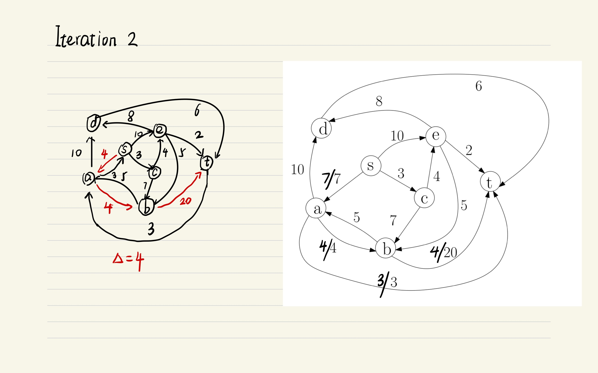
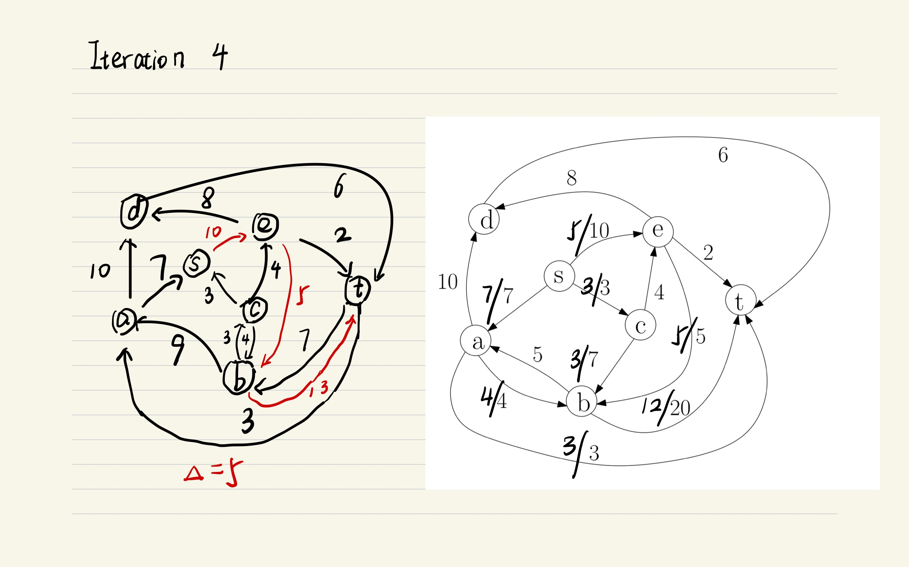
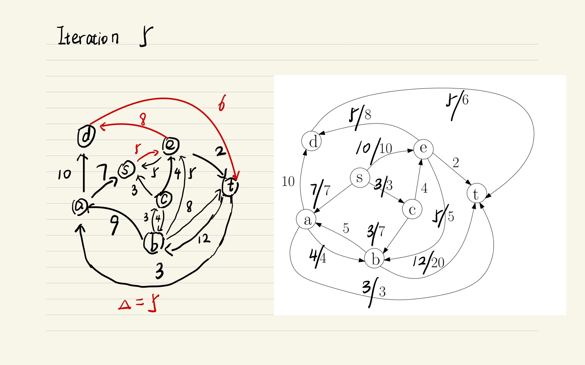

# Written Assignment 3

20932780 Zhang Hexiao

## Q1

#### a

Let $K$ denote the MST of $G$. Assume that $K$ does not contain $e$.

Let $K'=K\cup\{e\}$, $K'$ must have a cycle, and it must contain another $e’$ that connects vertices in $T$ to vertices not in $T$, satisfying $weight(e')\le weight(e)$.

So $K'-\{e'\}$ is a spanning tree that has a lower sum of weights than $K$. It's a paradox.

So K must contain $e$.

#### b

```python
INPUT: Adjacency List E[1...N], N is the number of vertices
OUTPUT: the MST edge list K

K = []
Init visited[1...N] with false
Init min-heap H
# starting from node 1
for edge in E[1]:
    H.push(edge)
visited[1] = ture
while H is not empty:
    # select the next edge with the lowest weight
    next_edge = H.popmin()
    if visited[next_edge.end]:
        continue
    visited[next_edge.end] = true
    K.append(next_edge)
    # add edges that connect the current tree and unvisited nodes
    for edge in E[next_edge.end]:
        if not visited[edge.end]:
            H.push(edge)
return K
```

Since each edge is pushed in and popped from the heap at most one time, the running time is $O(m\log m)=O(m\log n)$.

## Q2





## Q3










No more augmenting path. The maximum flow is 20.

## Q4

#### a

Assign capacity 1 to each edge, we can build a network flow graph from $G$. The minimum cut from $s$ to $t$ is the $st$ edge connectivity of $G$. According to the max-flow-min-cut theorem, the maximum flow from $s$ to $t$ is the answer we want.

#### b

Build a network flow graph like in (a). For any node $s$ in $G$, calculate the maximum flow from it to all other nodes. The minimum value of these maximum flows is the edge connectivity of $G$. We run the maximum flow algorithm $n-1$ times on $G$.

Correctness: Suppose the edge connectivity of $G$ is $K$. After removing $K$ edges, $G$ is divided into two subgraphs. The point $s$ must belong to one of them. The max flow from $s$ to a node from the other subgraph is the edge connectivity of $G$. So we calculate the maximum flow from s to all other nodes. The edge connectivity is the smallest of them. Because if not, we would be able to partition $G$ by removing a smaller number of edges, which contradicts the definition of edge connectivity.