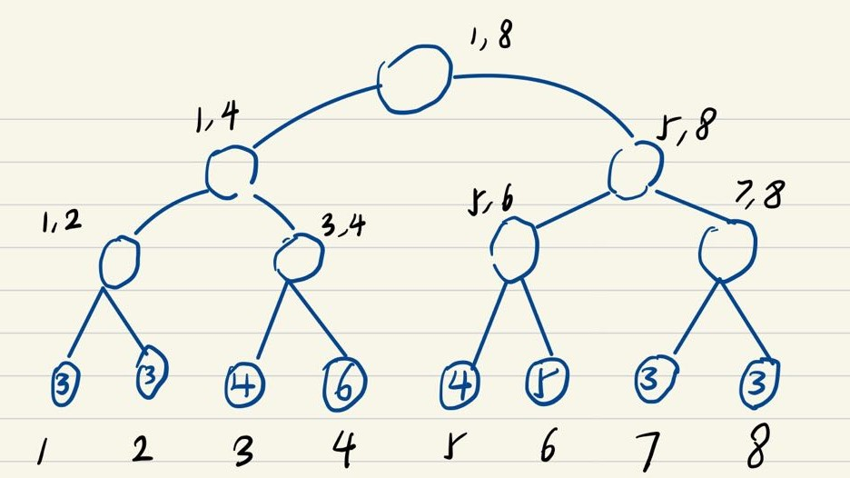
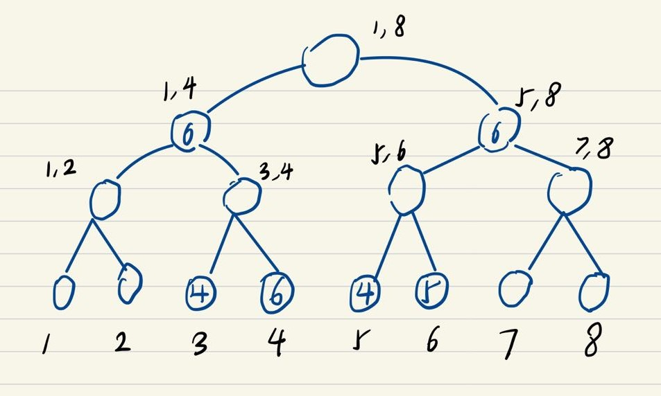

# Written Assignment 4

20932780 Zhang Hexiao

## Q1

### a

The table for each step is given as below.

| 6    |
| ---- |
| 1    |

| 3    | 6    |
| ---- | ---- |
| 1    | 1    |

| 3    | 6    | 8    |
| ---- | ---- | ---- |
| 1    | 1    | 1    |

| 3    | 6    | 7    | 8    |
| ---- | ---- | ---- | ---- |
| 1    | 1    | 1    | 1    |

| 3    | 6    | 7    | 8    |
| ---- | ---- | ---- | ---- |
| 1    | 2    | 1    | 1    |

| 3    | 6    | 7    | 8    |
| ---- | ---- | ---- | ---- |
| 1    | 2    | 1    | 2    |

| 6    | 8    |
| ---- | ---- |
| 1    | 1    |

| 3    | 6    | 8    |
| ---- | ---- | ---- |
| 1    | 1    | 1    |

| 3    | 6    | 8    |
| ---- | ---- | ---- |
| 1    | 1    | 2    |

| 3    | 6    | 8    |
| ---- | ---- | ---- |
| 1    | 2    | 2    |

| 3    | 5    | 6    | 8    |
| ---- | ---- | ---- | ---- |
| 1    | 1    | 2    | 2    |

| 3    | 5    | 6    | 8    |
| ---- | ---- | ---- | ---- |
| 1    | 1    | 3    | 2    |

| 6    | 8    |
| ---- | ---- |
| 2    | 1    |

| 3    | 6    | 8    |
| ---- | ---- | ---- |
| 1    | 2    | 1    |

| 3    | 4    | 6    | 8    |
| ---- | ---- | ---- | ---- |
| 1    | 1    | 2    | 1    |

| 3    | 4    | 6    | 8    |
| ---- | ---- | ---- | ---- |
| 1    | 1    | 2    | 2    |

| 3    | 4    | 6    | 8    |
| ---- | ---- | ---- | ---- |
| 1    | 1    | 3    | 2    |

| 3    | 4    | 6    | 8    |
| ---- | ---- | ---- | ---- |
| 1    | 2    | 3    | 2    |

| 3    | 4    | 6    | 8    |
| ---- | ---- | ---- | ---- |
| 1    | 2    | 3    | 3    |

| 4    | 6    | 8    |
| ---- | ---- | ---- |
| 1    | 2    | 2    |

| 4    | 6    | 8    |
| ---- | ---- | ---- |
| 1    | 3    | 2    |

| 4    | 6    | 7    | 8    |
| ---- | ---- | ---- | ---- |
| 1    | 3    | 1    | 2    |

| 6    | 8    |
| ---- | ---- |
| 2    | 1    |

| 6    | 8    | 9    |
| ---- | ---- | ---- |
| 2    | 1    | 1    |

| 6    | 8    | 9    |
| ---- | ---- | ---- |
| 2    | 2    | 1    |

| 1    | 6    | 8    | 9    |
| ---- | ---- | ---- | ---- |
| 1    | 2    | 2    | 1    |

| 1    | 6    | 8    | 9    |
| ---- | ---- | ---- | ---- |
| 1    | 2    | 3    | 1    |

| 1    | 6    | 8    | 9    |
| ---- | ---- | ---- | ---- |
| 1    | 3    | 3    | 1    |

| 6    | 8    |
| ---- | ---- |
| 2    | 2    |

| 2    | 6    | 8    |
| ---- | ---- | ---- |
| 1    | 2    | 2    |

| 2    | 6    | 8    | 9    |
| ---- | ---- | ---- | ---- |
| 1    | 2    | 2    | 1    |

| 2    | 6    | 8    | 9    |
| ---- | ---- | ---- | ---- |
| 1    | 3    | 2    | 1    |

| 2    | 6    | 8    | 9    |
| ---- | ---- | ---- | ---- |
| 1    | 3    | 3    | 1    |

| 6    | 8    |
| ---- | ---- |
| 2    | 2    |

| 6    | 8    |
| ---- | ---- |
| 3    | 2    |

| 6    | 8    |
| ---- | ---- |
| 3    | 3    |

| 6    | 7    | 8    |
| ---- | ---- | ---- |
| 3    | 1    | 3    |

| 6    | 7    | 8    |
| ---- | ---- | ---- |
| 3    | 1    | 4    |

| 2    | 6    | 7    | 8    |
| ---- | ---- | ---- | ---- |
| 1    | 3    | 1    | 4    |

### b

|                | 1    | 2    | 3    | 4    | 5    | 6    | 7    | 8    | 9    |
| -------------- | ---- | ---- | ---- | ---- | ---- | ---- | ---- | ---- | ---- |
| true freq      | 0    | 0    | 0    | 0    | 0    | 1    | 0    | 0    | 0    |
| estimated freq | 0    | 0    | 0    | 0    | 0    | 1    | 0    | 0    | 0    |

|                | 1    | 2    | 3    | 4    | 5    | 6    | 7    | 8    | 9    |
| -------------- | ---- | ---- | ---- | ---- | ---- | ---- | ---- | ---- | ---- |
| true freq      | 0    | 0    | 1    | 0    | 0    | 1    | 0    | 0    | 0    |
| estimated freq | 0    | 0    | 1    | 0    | 0    | 1    | 0    | 0    | 0    |

|                | 1    | 2    | 3    | 4    | 5    | 6    | 7    | 8    | 9    |
| -------------- | ---- | ---- | ---- | ---- | ---- | ---- | ---- | ---- | ---- |
| true freq      | 0    | 0    | 1    | 0    | 0    | 1    | 0    | 1    | 0    |
| estimated freq | 0    | 0    | 1    | 0    | 0    | 1    | 0    | 1    | 0    |

|                | 1    | 2    | 3    | 4    | 5    | 6    | 7    | 8    | 9    |
| -------------- | ---- | ---- | ---- | ---- | ---- | ---- | ---- | ---- | ---- |
| true freq      | 0    | 0    | 1    | 0    | 0    | 1    | 1    | 1    | 0    |
| estimated freq | 0    | 0    | 1    | 0    | 0    | 1    | 1    | 1    | 0    |

|                | 1    | 2    | 3    | 4    | 5    | 6    | 7    | 8    | 9    |
| -------------- | ---- | ---- | ---- | ---- | ---- | ---- | ---- | ---- | ---- |
| true freq      | 0    | 0    | 1    | 0    | 0    | 2    | 1    | 1    | 0    |
| estimated freq | 0    | 0    | 1    | 0    | 0    | 2    | 1    | 1    | 0    |

|                | 1    | 2    | 3    | 4    | 5    | 6    | 7    | 8    | 9    |
| -------------- | ---- | ---- | ---- | ---- | ---- | ---- | ---- | ---- | ---- |
| true freq      | 0    | 0    | 1    | 0    | 0    | 2    | 1    | 2    | 0    |
| estimated freq | 0    | 0    | 1    | 0    | 0    | 2    | 1    | 2    | 0    |

|                | 1    | 2    | 3    | 4    | 5    | 6    | 7    | 8    | 9    |
| -------------- | ---- | ---- | ---- | ---- | ---- | ---- | ---- | ---- | ---- |
| true freq      | 0    | 0    | 1    | 1    | 0    | 2    | 1    | 2    | 0    |
| estimated freq | 0    | 0    | 0    | 0    | 0    | 1    | 0    | 1    | 0    |

|                | 1    | 2    | 3    | 4    | 5    | 6    | 7    | 8    | 9    |
| -------------- | ---- | ---- | ---- | ---- | ---- | ---- | ---- | ---- | ---- |
| true freq      | 0    | 0    | 2    | 1    | 0    | 2    | 1    | 2    | 0    |
| estimated freq | 0    | 0    | 1    | 0    | 0    | 1    | 0    | 1    | 0    |

|                | 1    | 2    | 3    | 4    | 5    | 6    | 7    | 8    | 9    |
| -------------- | ---- | ---- | ---- | ---- | ---- | ---- | ---- | ---- | ---- |
| true freq      | 0    | 0    | 2    | 1    | 0    | 2    | 1    | 3    | 0    |
| estimated freq | 0    | 0    | 1    | 0    | 0    | 1    | 0    | 2    | 0    |

|                | 1    | 2    | 3    | 4    | 5    | 6    | 7    | 8    | 9    |
| -------------- | ---- | ---- | ---- | ---- | ---- | ---- | ---- | ---- | ---- |
| true freq      | 0    | 0    | 2    | 1    | 0    | 3    | 1    | 3    | 0    |
| estimated freq | 0    | 0    | 1    | 0    | 0    | 2    | 0    | 2    | 0    |

|                | 1    | 2    | 3    | 4    | 5    | 6    | 7    | 8    | 9    |
| -------------- | ---- | ---- | ---- | ---- | ---- | ---- | ---- | ---- | ---- |
| true freq      | 0    | 0    | 2    | 1    | 1    | 3    | 1    | 3    | 0    |
| estimated freq | 0    | 0    | 1    | 0    | 1    | 2    | 0    | 2    | 0    |

|                | 1    | 2    | 3    | 4    | 5    | 6    | 7    | 8    | 9    |
| -------------- | ---- | ---- | ---- | ---- | ---- | ---- | ---- | ---- | ---- |
| true freq      | 0    | 0    | 2    | 1    | 1    | 4    | 1    | 3    | 0    |
| estimated freq | 0    | 0    | 1    | 0    | 1    | 3    | 0    | 2    | 0    |

|                | 1    | 2    | 3    | 4    | 5    | 6    | 7    | 8    | 9    |
| -------------- | ---- | ---- | ---- | ---- | ---- | ---- | ---- | ---- | ---- |
| true freq      | 0    | 0    | 2    | 1    | 1    | 4    | 1    | 3    | 1    |
| estimated freq | 0    | 0    | 0    | 0    | 0    | 2    | 0    | 1    | 0    |

|                | 1    | 2    | 3    | 4    | 5    | 6    | 7    | 8    | 9    |
| -------------- | ---- | ---- | ---- | ---- | ---- | ---- | ---- | ---- | ---- |
| true freq      | 0    | 0    | 3    | 1    | 1    | 4    | 1    | 3    | 1    |
| estimated freq | 0    | 0    | 1    | 0    | 0    | 2    | 0    | 1    | 0    |

|                | 1    | 2    | 3    | 4    | 5    | 6    | 7    | 8    | 9    |
| -------------- | ---- | ---- | ---- | ---- | ---- | ---- | ---- | ---- | ---- |
| true freq      | 0    | 0    | 3    | 2    | 1    | 4    | 1    | 3    | 1    |
| estimated freq | 0    | 0    | 1    | 1    | 0    | 2    | 0    | 1    | 0    |

|                | 1    | 2    | 3    | 4    | 5    | 6    | 7    | 8    | 9    |
| -------------- | ---- | ---- | ---- | ---- | ---- | ---- | ---- | ---- | ---- |
| true freq      | 0    | 0    | 3    | 2    | 1    | 4    | 1    | 4    | 1    |
| estimated freq | 0    | 0    | 1    | 1    | 0    | 2    | 0    | 2    | 0    |

|                | 1    | 2    | 3    | 4    | 5    | 6    | 7    | 8    | 9    |
| -------------- | ---- | ---- | ---- | ---- | ---- | ---- | ---- | ---- | ---- |
| true freq      | 0    | 0    | 3    | 2    | 1    | 5    | 1    | 4    | 1    |
| estimated freq | 0    | 0    | 1    | 1    | 0    | 3    | 0    | 2    | 0    |

|                | 1    | 2    | 3    | 4    | 5    | 6    | 7    | 8    | 9    |
| -------------- | ---- | ---- | ---- | ---- | ---- | ---- | ---- | ---- | ---- |
| true freq      | 0    | 0    | 3    | 3    | 1    | 5    | 1    | 4    | 1    |
| estimated freq | 0    | 0    | 1    | 2    | 0    | 3    | 0    | 2    | 0    |

|                | 1    | 2    | 3    | 4    | 5    | 6    | 7    | 8    | 9    |
| -------------- | ---- | ---- | ---- | ---- | ---- | ---- | ---- | ---- | ---- |
| true freq      | 0    | 0    | 3    | 3    | 1    | 5    | 1    | 5    | 1    |
| estimated freq | 0    | 0    | 1    | 2    | 0    | 3    | 0    | 3    | 0    |

|                | 1    | 2    | 3    | 4    | 5    | 6    | 7    | 8    | 9    |
| -------------- | ---- | ---- | ---- | ---- | ---- | ---- | ---- | ---- | ---- |
| true freq      | 0    | 0    | 3    | 3    | 2    | 5    | 1    | 5    | 1    |
| estimated freq | 0    | 0    | 0    | 1    | 0    | 2    | 0    | 2    | 0    |

|                | 1    | 2    | 3    | 4    | 5    | 6    | 7    | 8    | 9    |
| -------------- | ---- | ---- | ---- | ---- | ---- | ---- | ---- | ---- | ---- |
| true freq      | 0    | 0    | 3    | 3    | 2    | 6    | 1    | 5    | 1    |
| estimated freq | 0    | 0    | 0    | 1    | 0    | 3    | 0    | 2    | 0    |

|                | 1    | 2    | 3    | 4    | 5    | 6    | 7    | 8    | 9    |
| -------------- | ---- | ---- | ---- | ---- | ---- | ---- | ---- | ---- | ---- |
| true freq      | 0    | 0    | 3    | 3    | 2    | 6    | 2    | 5    | 1    |
| estimated freq | 0    | 0    | 0    | 1    | 0    | 3    | 1    | 2    | 0    |

|                | 1    | 2    | 3    | 4    | 5    | 6    | 7    | 8    | 9    |
| -------------- | ---- | ---- | ---- | ---- | ---- | ---- | ---- | ---- | ---- |
| true freq      | 0    | 0    | 4    | 3    | 2    | 6    | 2    | 5    | 1    |
| estimated freq | 0    | 0    | 0    | 0    | 0    | 2    | 0    | 1    | 0    |

|                | 1    | 2    | 3    | 4    | 5    | 6    | 7    | 8    | 9    |
| -------------- | ---- | ---- | ---- | ---- | ---- | ---- | ---- | ---- | ---- |
| true freq      | 0    | 0    | 4    | 3    | 2    | 6    | 2    | 5    | 2    |
| estimated freq | 0    | 0    | 0    | 0    | 0    | 2    | 0    | 1    | 1    |

|                | 1    | 2    | 3    | 4    | 5    | 6    | 7    | 8    | 9    |
| -------------- | ---- | ---- | ---- | ---- | ---- | ---- | ---- | ---- | ---- |
| true freq      | 0    | 0    | 4    | 3    | 2    | 6    | 2    | 6    | 2    |
| estimated freq | 0    | 0    | 0    | 0    | 0    | 2    | 0    | 2    | 1    |

|                | 1    | 2    | 3    | 4    | 5    | 6    | 7    | 8    | 9    |
| -------------- | ---- | ---- | ---- | ---- | ---- | ---- | ---- | ---- | ---- |
| true freq      | 1    | 0    | 4    | 3    | 2    | 6    | 2    | 6    | 2    |
| estimated freq | 1    | 0    | 0    | 0    | 0    | 2    | 0    | 2    | 1    |

|                | 1    | 2    | 3    | 4    | 5    | 6    | 7    | 8    | 9    |
| -------------- | ---- | ---- | ---- | ---- | ---- | ---- | ---- | ---- | ---- |
| true freq      | 1    | 0    | 4    | 3    | 2    | 6    | 2    | 7    | 2    |
| estimated freq | 1    | 0    | 0    | 0    | 0    | 2    | 0    | 3    | 1    |

|                | 1    | 2    | 3    | 4    | 5    | 6    | 7    | 8    | 9    |
| -------------- | ---- | ---- | ---- | ---- | ---- | ---- | ---- | ---- | ---- |
| true freq      | 1    | 0    | 4    | 3    | 2    | 7    | 2    | 7    | 2    |
| estimated freq | 1    | 0    | 0    | 0    | 0    | 3    | 0    | 3    | 1    |

|                | 1    | 2    | 3    | 4    | 5    | 6    | 7    | 8    | 9    |
| -------------- | ---- | ---- | ---- | ---- | ---- | ---- | ---- | ---- | ---- |
| true freq      | 1    | 0    | 5    | 3    | 2    | 7    | 2    | 7    | 2    |
| estimated freq | 0    | 0    | 0    | 0    | 0    | 2    | 0    | 2    | 0    |

|                | 1    | 2    | 3    | 4    | 5    | 6    | 7    | 8    | 9    |
| -------------- | ---- | ---- | ---- | ---- | ---- | ---- | ---- | ---- | ---- |
| true freq      | 1    | 1    | 5    | 3    | 2    | 7    | 2    | 7    | 2    |
| estimated freq | 0    | 1    | 0    | 0    | 0    | 2    | 0    | 2    | 0    |

|                | 1    | 2    | 3    | 4    | 5    | 6    | 7    | 8    | 9    |
| -------------- | ---- | ---- | ---- | ---- | ---- | ---- | ---- | ---- | ---- |
| true freq      | 1    | 1    | 5    | 3    | 2    | 7    | 2    | 7    | 3    |
| estimated freq | 0    | 1    | 0    | 0    | 0    | 2    | 0    | 2    | 1    |

|                | 1    | 2    | 3    | 4    | 5    | 6    | 7    | 8    | 9    |
| -------------- | ---- | ---- | ---- | ---- | ---- | ---- | ---- | ---- | ---- |
| true freq      | 1    | 1    | 5    | 3    | 2    | 8    | 2    | 7    | 3    |
| estimated freq | 0    | 1    | 0    | 0    | 0    | 3    | 0    | 2    | 1    |

|                | 1    | 2    | 3    | 4    | 5    | 6    | 7    | 8    | 9    |
| -------------- | ---- | ---- | ---- | ---- | ---- | ---- | ---- | ---- | ---- |
| true freq      | 1    | 1    | 5    | 3    | 2    | 8    | 2    | 8    | 3    |
| estimated freq | 0    | 1    | 0    | 0    | 0    | 3    | 0    | 3    | 1    |

|                | 1    | 2    | 3    | 4    | 5    | 6    | 7    | 8    | 9    |
| -------------- | ---- | ---- | ---- | ---- | ---- | ---- | ---- | ---- | ---- |
| true freq      | 1    | 1    | 5    | 4    | 2    | 8    | 2    | 8    | 3    |
| estimated freq | 0    | 0    | 0    | 0    | 0    | 2    | 0    | 2    | 0    |

|                | 1    | 2    | 3    | 4    | 5    | 6    | 7    | 8    | 9    |
| -------------- | ---- | ---- | ---- | ---- | ---- | ---- | ---- | ---- | ---- |
| true freq      | 1    | 1    | 5    | 4    | 2    | 9    | 2    | 8    | 3    |
| estimated freq | 0    | 0    | 0    | 0    | 0    | 3    | 0    | 2    | 0    |

|                | 1    | 2    | 3    | 4    | 5    | 6    | 7    | 8    | 9    |
| -------------- | ---- | ---- | ---- | ---- | ---- | ---- | ---- | ---- | ---- |
| true freq      | 1    | 1    | 5    | 4    | 2    | 9    | 2    | 9    | 3    |
| estimated freq | 0    | 0    | 0    | 0    | 0    | 3    | 0    | 3    | 0    |

|                | 1    | 2    | 3    | 4    | 5    | 6    | 7    | 8    | 9    |
| -------------- | ---- | ---- | ---- | ---- | ---- | ---- | ---- | ---- | ---- |
| true freq      | 1    | 1    | 5    | 4    | 2    | 9    | 3    | 9    | 3    |
| estimated freq | 0    | 0    | 0    | 0    | 0    | 3    | 1    | 3    | 0    |

|                | 1    | 2    | 3    | 4    | 5    | 6    | 7    | 8    | 9    |
| -------------- | ---- | ---- | ---- | ---- | ---- | ---- | ---- | ---- | ---- |
| true freq      | 1    | 1    | 5    | 4    | 2    | 9    | 3    | 10   | 3    |
| estimated freq | 0    | 0    | 0    | 0    | 0    | 3    | 1    | 4    | 0    |

|                | 1    | 2    | 3    | 4    | 5    | 6    | 7    | 8    | 9    |
| -------------- | ---- | ---- | ---- | ---- | ---- | ---- | ---- | ---- | ---- |
| true freq      | 1    | 2    | 5    | 4    | 2    | 9    | 3    | 10   | 3    |
| estimated freq | 0    | 1    | 0    | 0    | 0    | 3    | 1    | 4    | 0    |

## Q2

| Array C | 0    | 1    | 2    | 3    | 4    |
| ------- | ---- | ---- | ---- | ---- | ---- |
| h0      | 6    | 8    | 8    | 7    | 11   |
| h1      | 11   | 7    | 8    | 8    | 6    |

|             | 0    | 1    | 2    | 3    | 4    | 5    | 6    | 7    | 8    | 9    |
| ----------- | ---- | ---- | ---- | ---- | ---- | ---- | ---- | ---- | ---- | ---- |
| $\hat{f_a}$ | 7    | 6    | 8    | 11   | 8    | 7    | 6    | 8    | 11   | 8    |

## Q3

### a

The complete binary tree is given as below.



After running the compression algorithm to identify the q-digest nodes:



### b

The q-digest is:

| 3    | 4    | [1, 4] | 5    | 6    | [5, 8] |
| ---- | ---- | ------ | ---- | ---- | ------ |
| 4    | 6    | 5      | 4    | 5    | 6      |

So the 15th element is 4.

## Q4

### a

Since $H_j\sub H_{j-1}$, if $v_{j-1} \in h_j^+$, then  $v_{j-1}\in H_j$. Given that $v_{j-1}$ is the optimal point in $H_{j-1}$, it is also the optimal point in $H_j$, i.e. $v_j=v_{j-1}$.

If $v_{j-1} \notin h_j^+$, assume that $v_j$ is not on the line $h_j$. Then the intersection of the line $v_jv_{j-1}$ with $h_j$ is a better choice. Contradiction. So $v_j$ must be on $h_j$.

### b

$P(v_j\in h_j)\le2/j$. Because the optimal solution falls on at most two of $j$ lines that form $H_j$.

### c

Calculate the intersection point $(x_1,y_1),\cdots,(x_j,y_i)$ between $H$ and each line of $l_1,\cdots,l_j$ in $O(j)$ time. By this we can get the intersection between $H$ and $l_i^+$ for $i\in\{1,\cdots,j\}$, which is
$$
\{x\le x_i\}\ or\ \{x\ge x_i\}
$$
It is easy to compute the intersection of these $j$ intervals in $O(j)$ time. Let's denote it as $[x_{left},x_{right}]$. The optimal solution must be one of the two endpoints.

The algorithm will take $O(j)$ time overall.

### d

The algorithm is given as below. Note that in the algorithm proposed in (c), we convert the problem from the two-dimensional plane to the x-axis.

```
Let v3 be the optimal solution in H3
for hi from h4 to hn:
	if vi-1 in hi+:
		vi = vi-1
	else:
		Calculate the optimal solution vi of hi ∩ Hi-1 by the mothod in (c).
return vn
```

### e

The running time is
$$
\sum_{i=2}^n [O(1)P(v_{i-1}\in h_i^+)+O(i)P(v_{i-1}\notin h_i^+)]\le O(n)+\sum_{i=1}^n O(i)\frac{2}{i}=O(n)
$$
