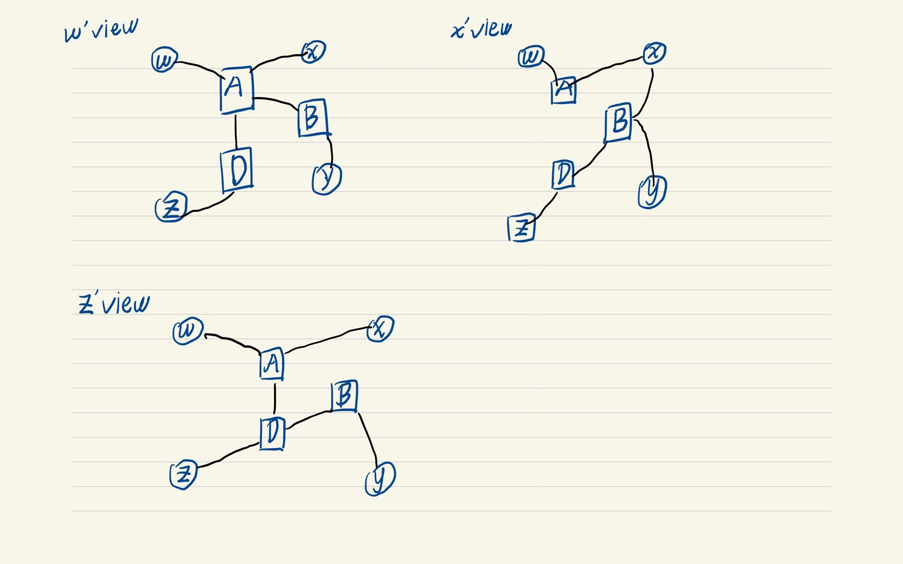

# Homework 3

20932780 Zhang Hexiao

### Q1

For w, the least-hop path from w to x is `w, A, x`, from w to y is `w, A, B, y`, from w to z is `w, A, D, z`. There is no other alternative.

For z, the least-hop path from z to w is `z, D, A, w`, from z to y is `z, D, B, y`, from z to x is `z, D, B, x` or `z, D, A, x`. Since the link `D, B` has been occupied by the path from z to y, we choose `z, D, A, x` as the path from z to x.

For x, the least-hop path from x to y is `x, B, y`, from x to w is `x, A, w`, from x to z is `x, B, D, z` or `x, A, D, z`. Based on our policy, both paths from x to z are acceptable.

### Q2

#### a

subnet mask: 1111 1111 1111 1111 1111 1100 0000 0000, 255.255.252.0

#### b

The all-ones host address of the subnet is that its broadcast address. It is 143.89.67.255.

#### c

`143.89.64.100 & 255.255.252.0 == 143.89.64.0`, 

`143.88.64.1 & 255.255.252.0 != 143.89.64.0`, 

`143.89.65.64 & 255.255.252.0 == 143.89.64.0`, 

`143.89.67.64 & 255.255.252.0 == 143.89.64.0`

So 143.89.64.100, 143.89.65.64, 143.89.67.64 belong to this subnet, while 143.88.64.1 not.

### Q3

| Step   | N'        | D(A) | D(B)  | D(C) | D(D) | D(E) | D(G) | D(H)  |
| ------ | --------- | ---- | ----- | ---- | ---- | ---- | ---- | ----- |
| 0      | F         | ∞    | ∞     | ∞    | 3, F | 1, F | 6, F | ∞     |
| 1      | EF        | ∞    | ∞     | 4. E | 2. E |      | 6, F | ∞     |
| 2      | DEF       | ∞    | 11, D | 3, D |      |      | 3, D | ∞     |
| 3      | CDEF      | 7, C | 5, C  |      |      |      | 3, D | ∞     |
| 4      | GCDEF     | 7, C | 5, C  |      |      |      |      | 17, G |
| 5      | BCDEFG    | 6, B |       |      |      |      |      | 7, B  |
| 6      | ABCDEFG   |      |       |      |      |      |      | 7, B  |
| 7      | All Nodes |      |       |      |      |      |      |       |
| Result |           | 6, B | 5, C  | 3, D | 2, E | 1, F | 3, D | 7, B  |

### Q4

#### a

Dx(w) = 2, Dx(y) = 4, Dx(u) = 7.

#### b

If c(x,y) changes and $c(x,y)\ge 1$, the cost from x to u will still be at least 7. So x will not inform its neighbors of any changes.

If c(x,y) changes and $c(x,y)=\delta< 1$, then the cost from x to u will be $6+\delta$ now. x will inform its neighbors of the new path and new cost.

If c(x,w) changes and $c(x,w)=\epsilon\le 6$, the cost from x to u will still be $5+\epsilon$. x will inform its neighbors of new cost.

If c(x,w) changes and $c(x,w)> 6$,  x will choose y to forward packets to u now. x will inform its neighbors of new cost 11.