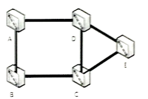
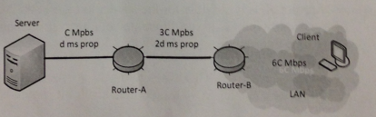

# Problem 1 Circuit switching 

**a) Explain why TDM is a cost-effective form of multiplexing for a voice telephone network (GSM) and FDM  is a cost-effective form of multiplexing for television and radio networks, yet we reject both as not being  cost effective for general-purpose computer networks.**

**Consider now the following circuit switched network made up of five switches (A, B, C, D and E) connected  as shown via 6 links. Each link has $n$ FDM circuits and each FDM circuit is slotted in a revolving frame of $m$ TDM slots. Assuming that any connection between any two users requires one time slot for uplink and one  slot for downlink communication.**

**b) What is the maximum number of connections that can be established at a given particular time slot in this network?**

**c) What is the maximum total number of connections that can be simultaneously in progress in the network?**

**d) Assuming that all connections originate at switch C and are destined to users on switch D, what is the maximum number of simultaneous connections that can be in progress now?**

## Problem 2 Reliable Data Transfer

**a) describe a channel condition (bit errors, losses. and so on) under which the receiver of rdt3.0 would accept stale (old) duplicate data as new data and delivers it to the upper layer. Draw the time space diagram to illustrate this condition (in the trace use M0, M1,..., for data and A0, A1 ... for Acks)**

**b) How many bits are needed for the sequence number in Go Back N, given a window of size R (explain your answer)?**

**c) In the Go Back N protocol, is it possible for the sender to receive an ACK for a packet that falls outside of it current window? If yes, illustrate your answer with an example by drawing the corresponding time diagram if no explain why. (5pts)**

## Problem 3 Reliable Data Transfer

**A company in Hong Kong  recently upgraded its Internet link to 6 Mbps connection to a site in California. The distance between Hong Kong and the site in California is approximately 7500 miles. Data travels over the link at the speed of light, which is 186,000 miles per second. **

**Suppose we run the stop-and-wait protocol for reliability over the point-to-point link. Assuming that each frame carries 1 Kbytes of data.**

**a) Calculate the efficiency of the protocol over this link, and deduce the connection throughput. (Show all your steps)**

**b) Given the observed poor performance of stop and wait protocol in terms of throughput above, explain why it is still use in many network technologies, and especially in local area networks such as WIFI.**

## Problem 4 Bottlenecks, HTTP Throughput

**Consider the following network topology where a server is connected to router A via a $C$ Mbps link with a $d$ ms propagation delay. Router B is connected to router A via a $3C$ Mbps link with a $2d$ ms propagation delay. A LAN of $6C$ Mbps and 0 propagation delay connects a Client to router B. Assuming all packets in this network are L bits long and that HTTP request messages are negligible in size:**

**a) What is the end-to-end round trip time (RTT) i.e., the time it take a negligible size packet between the client and the server over this network, assuming that there is neither queueing delay at any link nor packet processing delay at any router?**

**b) What is the capacity of the bottleneck link in this network?**

**c) Assume that the Client sends an http request to the server, and that the server uses non-persistent http to send back an object of size 3 packets. Express the response time of the request in terms of RTT, L and C. Illustrate the exchange by drawing the time-space diagram.**

**d) Derive from b) a general formula for the response time in this network when the object size  is N packets of length L, and deduce what is the asymptotic efficiency (i.e. for a large value of N) of this network.**

## Problem 5 UDP Checksum

**The following sequence of bytes in hexadecimal format is a fragment of a UDP datagram.**

**45 00 40 43 43 28 40 00 28 06**

**a) State briefly how is the UDP checksum calculated and how it is used to detect errors.**

**b) Calculate the UDP checksum for the fragment. Show the major steps.**

**c) If we send the fragment above after appending to its tail the checksum and receive the following fragment:**

**45 00 40 43 43 28 40 00 28 06 CF 8E**

**What can we conclude and why?**

## Problem 6 P2P file distribution

**Consider a simplified BitTorrent scenario. There is a swarm of $2^n$ peers. Assume no peer joins or leaves. It takes a peer 2 units of time to upload or download a chunk, during which time it can only do one or the other not both. Initially one peer has the whole file and the others  have nothing.**

**a) If the swarm's target file consists of only 1 chunk, what is the minimum time necessary for all the peers to obtain the file? Ignore all but upload / download time. Explain your answer.**

**b) If the swarm's target file consists of 2 chunks, what is the minimum time needed for all peers to obtain the file (assuming $n > 3$) ? Give a distribution scheme that achieves this minimum time.**

## Problem 7 Queuing delay and Congestion

**Consider the queuing delay in a router buffer (preceding an outbound link). Suppose all packets are bits long, the transmission rate is R bps,, and that N packets simultaneously arrive at the buffer every LN/R seconds.**

**Find the average queuing delay of a packet. Explain and show your steps.**  