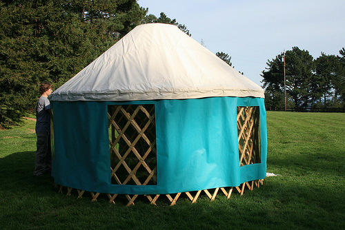
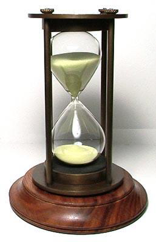
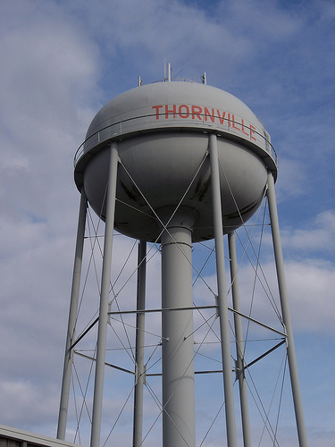
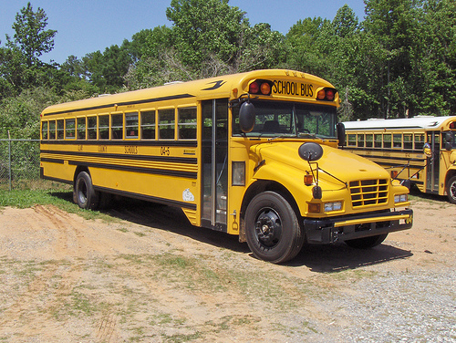
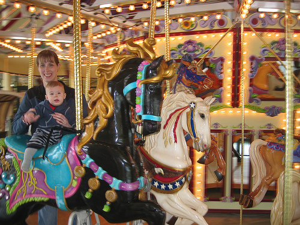

# Homework Assignment 4

20932780 Zhang Hexiao

All models are loaded with default arguments and correctly predict all test samples. The output probability for the true label is as below.

|                 | True Label  | Resnet50 | VGG16 | InceptionV3 | Densenet121 | EfficientNetB2 | MobileNetV2 |
| --------------- | ----------- | -------- | ----- | ----------- | ----------- | -------------- | ----------- |
|    | rapeseed    | 1.00     | 1.00  | 1.00        | 1.00        | 0.90           | 1.00        |
|    | peacock     | 1.00     | 1.00  | 0.99        | 1.00        | 0.85           | 0.98        |
|    | yurt        | 1.00     | 1.00  | 1.00        | 1.00        | 0.75           | 0.95        |
|    | hourglass   | 1.00     | 1.00  | 1.00        | 1.00        | 0.94           | 0.95        |
|    | water_tower | 1.00     | 1.00  | 0.99        | 1.00        | 0.86           | 0.96        |
|    | zebra       | 1.00     | 1.00  | 0.99        | 1.00        | 0.89           | 0.97        |
|    | school_bus  | 1.00     | 1.00  | 1.00        | 1.00        | 0.90           | 0.99        |
|    | pillow      | 1.00     | 1.00  | 1.00        | 1.00        | 0.95           | 1.00        |
|    | fireboat    | 1.00     | 1.00  | 0.95        | 1.00        | 0.85           | 0.85        |
|  | carousel    | 1.00     | 1.00  | 0.97        | 1.00        | 0.88           | 0.99        |

The "fireboat" is a harder sample to classify, which is true even for human.  

The slightly lower prediction probability of correct classification for EfficientNetB2 and MobileNetV2 is reasonable since they have fewer parameters. 
