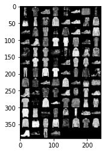
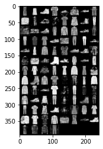
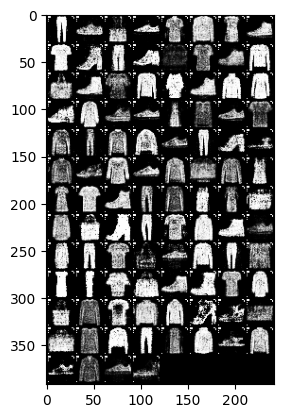
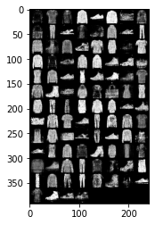
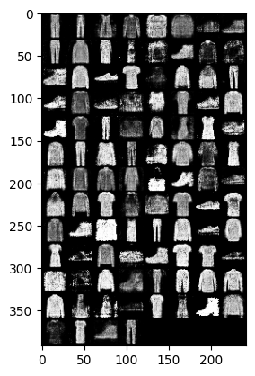
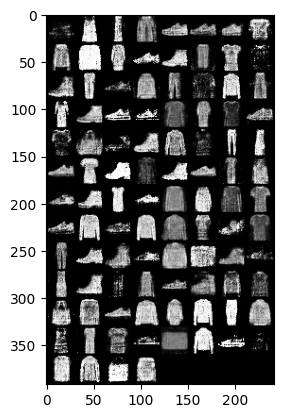
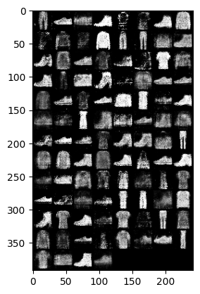
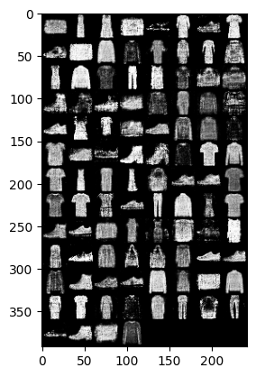

# Homework Assignment 6

20932780 ZHANG Hexiao

The baseline model and hyperparameters follow these defined in the tutorial, which is given as below.

| Layer of the Generator | Input            | Output           |
| ---------------------- | ---------------- | ---------------- |
| Linear + Relu          | (*, latent_size) | (*, hidden_size) |
| Linear + Relu          | (*, hidden_size) | (*, hidden_size) |
| Linear + Tanh          | (*, hidden_size) | (*, image_size)  |

| Layer of the Discriminator | Input            | Output           |
| -------------------------- | ---------------- | ---------------- |
| Linear + Relu              | (*, image_size)  | (*, hidden_size) |
| Linear + Relu              | (*, hidden_size) | (*, hidden_size) |
| Linear + Sigmoid           | (*, hidden_size) | (*, 2)           |

| Hyper parameter  | Value  |
| ---------------- | ------ |
| latent_size      | 128    |
| hidden_size      | 256    |
| number of epochs | 200    |
| batch_size       | 100    |
| learning_rate    | 0.0002 |

It's hard to distinguish the result from the generated pictures. To quantitatively compare the performance between the models, we use the **Frechet Inception Distance (FID)** to compare the direct differences between the generated results and the real data. The lower the FID, the smaller the differences and the better the generated results.

Experiments are conducted by varying a certain aspect of the baseline model.

| Model                    | FID     | Results                                                      |
| ------------------------ | ------- | ------------------------------------------------------------ |
| Baseline                 | 114.290 |                                     |
| hidden_size=512          | 98.598  |                                 |
| With Batch Normalization | 125.284 |             |
| latent_size = 128        | 107.064 |                |
| latent_size = 256        | 100.029 |  |
| latent_size = 512        | 108.927 |  |
| number of epochs = 100   | 120.618 |  |
| number of epochs = 300   | 101.618 |  |

Training the GAN is difficult. It's hard to judge whether the generator fits well from the training loss. From the results, the appropriate increase in the number of parameters and mote training epochs help to improve the performance, which indicates that the baseline is underfitting.

However, if the dimensionality of the hidden variables is too large, or with batch normalization, it will degrade the performance. This may be related to many factors. But for the latter, it may be because the hidden variables are of the same magnitude, so normalization is not very helpful.
