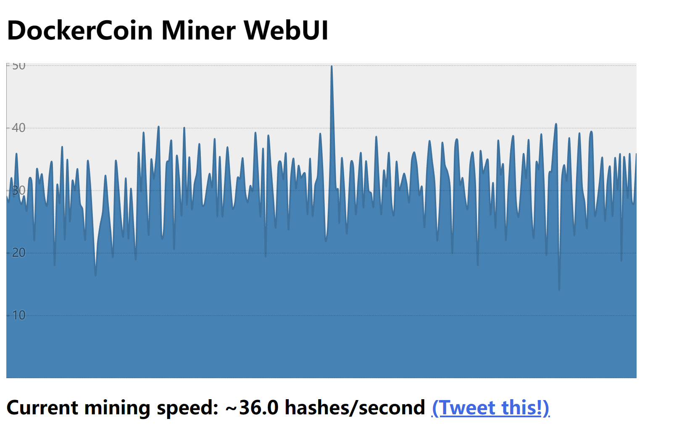
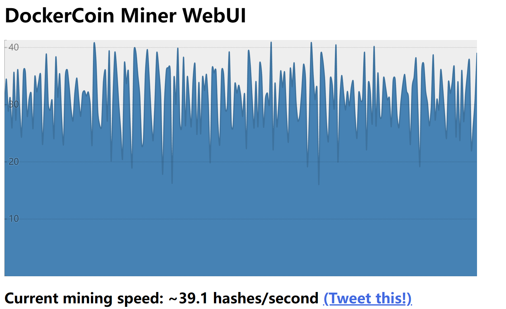

# Assignment-6 Questions

## Basic Information

Name: Zhang Hexiao

Student ID: 20932780

---

## (2 points) Report the performance of DockerCoins with different number of workers.

(1 point) TODO: Replace <FILL_IN> with the appropriate result.

| # of workers  | 1    | 2    | 3    | 4    | 5    | 10   |
| ------------- | ---- | ---- | ---- | ---- | ---- | ---- |
| hashes/second | 4.0 | 8.0 | 12.0 | 12.0 | 10.0 | 10.0 |

(1 point) When you have 10x workers, how much the performance is improved? Please describe the potential reasons for this phenomenon.

Only 2.5x performance is improved compared to 1 worker. Performance improvements are not linear, and there are diminishing returns as we continue to add more workers than 4. Possible reasons are given below.

Running DockerCoins on an EC2 m5.large instance, which has 2 vCPUs and 2 threads per CPU, will provide a total of 4 threads for parallel execution. If we continue to increase the number of workers beyond the available threads, we will start to experience diminishing returns on performance improvements. This is because the additional workers will compete for the available CPU resources, and the overhead of managing and communicating between the workers can become a bottleneck.

## (1 point) Detect latency and find the bottleneck component (rng or hasher).

(0.5 point) TODO: Replace <FILL_IN> with the appropriate result.

| Service      | Hasher | Rng  |
| ------------ | ------ | ---- |
| Average Latency (ms) | 1.1 | 728.1 |

(0.5 point) Which service is the bottleneck? 

Rng is the bottleneck.

## (1 point) Upload the screenshot of WebUI after setting up the hpa.



## (2 points) Open question: how to reduce the fluctuation of the HPA?

Apart from the autoscaling policy we provided, think about how to reduce the fluctuation of the HPA? Explain your method in details and show how you setup your own HPA. You need to upload a screenshot of the WebUI after the optimization for comparison.

I adjusted the HPA configuration.

> [enhancements/README.md at master · kubernetes/enhancements (github.com)](https://github.com/kubernetes/enhancements/blob/master/keps/sig-autoscaling/853-configurable-hpa-scale-velocity/README.md)

We can adjust the speed of scaling to reduce the fluctuation. The strategy "Scale Up As Fast As Possible, Scale Down Very Gradually" is a choice. This strategy helps ensure that applications can scale quickly to meet demand in the face of bursts of traffic, while avoiding scaling down too quickly when the load decreases, causing the system to become too sensitive or cut too many resources.

```yaml
  behavior:
    scaleUp:
      stabilizationWindowSeconds: 60
      policies:
        - type: Percent
          value: 900
          periodSeconds: 60
    scaleDown:
      stabilizationWindowSeconds: 180
      policies:
        - type: Pods
          value: 1
          periodSeconds: 300
```



After modifying the configuration, the fluctuations were somewhat mitigated but still significant although scaling was stable. We may need a better solution.
