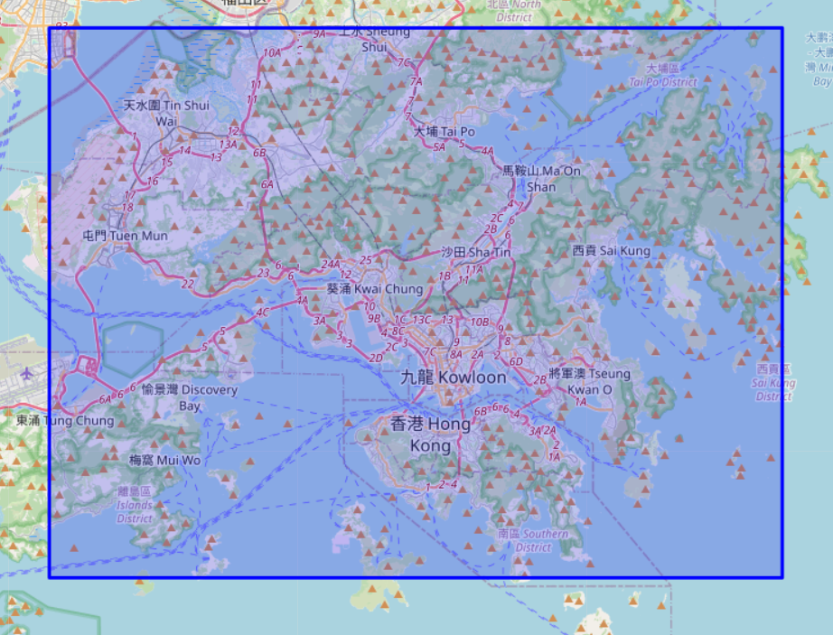
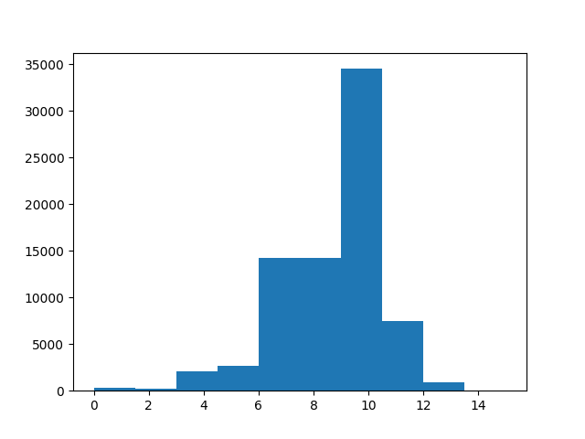

# Assignment 1

20932780 Zhang Hexiao

## Task 1

The MBR of D is

```
MBR(xmin=113.9310037, ymin=22.1973011, xmax=114.3763554, ymax=22.5069962)
```

The area on the real map is plotted as below,




To calculate the true length and width of the MBR on Earth, I used the `pyproj` library.

```python
from pyproj import Geod
from shapely import LineString

GEOD = Geod(ellps="WGS84")
# True length of MBR(self) in cm
length = GEOD.geometry_length(LineString([(self.xmin, self.ymin), (self.xmax, self.ymin)])) * 100
width = GEOD.geometry_length(LineString([(self.xmin, self.ymin), (self.xmin, self.ymax)])) * 100
```

| resolution | size (cm * cm)               |                                                              |
| ---------- | ---------------------------- | ------------------------------------------------------------ |
| 12         | 1121.19 * 837.26 = 938727.54 | width is larger than 14.29% MBRs,  <br />length is larger than 29.93% MBRs. |
| 16         | 70.07 * 52.33 = 3666.76      | width is larger than 0.00% MBRs,  <br />length is larger than 0.00% MBRs. |
| 20         | 4.38 * 3.27 = 14.32          | width is larger than 0.00% MBRs,  <br />length is larger than 0.00% MBRs. |

When n=12, the granularity is sufficient to distinguish most MBRs. When n=16, almost all MBRs are distinguishable. So n=16 is a suitable choice.

## Task 2

In my implementation, I calculate the **maximum resolution** of each MBR first, which means that **the MBR can't be represented by just one z-value when the resolution is larger**.

The pseudo code to calculate the maximum resolution is as follows,

```python
def get_max_resolution(target: MBR):
    n = 0
    while True:
        n += 1
        zhigh = the zvalue of point (target.xmax, target.ymax) when resolution is n
        zlow = the zvalue of point (target.xmin, target.ymin) when resolution is n
		if zhigh != zlow: # indicating MBR can't be represented by one zvalue
            n -= 1
            break
    return n
```

Then we can calculate the z-value of the bottom left point of the MBR under the maximum resolution. This z-value is sufficient to represent the corresponding MBR. When the resolution changes, we just need to intercept or pad "0" to that z-value.

The distribution of the maximum resolution is plotted as below. For most of the MBRs, n=12 is sufficient to express their z-value. **The z-values of most MBRs is the same after removing the padded zeros under different resolutions (n=12, 16, 20)**.



In the case of using only one z-value, if an MBR happens to **span the boundary of a piano cell** at a certain resolution, No matter how small the MBR is, it cannot be represented at this resolution.

A direct solution is to use more z-values to represent the MBR.

## Task 3

For the window query, we calculate the minimum and maximum z-values first.  Since our data is static, I use an array instead of a search tree to store polygons. They are sorted by their z-values. 

The pseudo code of the query method is as follows,

```python
def search(dataset: list[Polygon], query: Polygon, query_zlow: str, query_zhigh: str):
    start = the index of first polygon that in the same piano cell with query_zlow and query_zhigh
    end = the index of first polygon whose zvalue is bigger than query_zhigh
    cnt = 0	# count the number of retrieved objects
    for poly in dataset[start, end]:
        if query.contains(poly):	# This method is provided by shapely
            cnt += 1
```

The position, length and width of the query rectangle are randomly generated. 

```python
def random_rectangle(total_mbr: MBR) -> Polygon:
    width = uniform(0, total_mbr.xmax - total_mbr.xmin) / 16
    height = uniform(0, total_mbr.ymax - total_mbr.ymin) / 16
    xmin = uniform(total_mbr.xmin, total_mbr.xmax - width)
    ymin = uniform(total_mbr.ymin, total_mbr.ymax - height)
```

The experimental results are as follows. **The results of the search using z-values are consistent with the brute force search, verifying the correctness of the implementation**. 

Z-values significantly reduce the number of objects searched. But for different resolutions, there is no difference. This may be caused by the dataset and the generation strategy of random rectangles.

| Testcase | No. retrieved objects | Brute-force | Z-index(12) | Z-index(16) | Z-index(20) |
| -------- | --------------------- | ----------- | ----------- | ----------- | ----------- |
| 0        | 18                    | 76718       | 559         | 559         | 559         |
| 1        | 0                     | 76718       | 1           | 1           | 1           |
| 2        | 22                    | 76718       | 618         | 618         | 618         |
| 3        | 1                     | 76718       | 70          | 70          | 70          |
| 4        | 93                    | 76718       | 2320        | 2320        | 2320        |
| 5        | 0                     | 76718       | 1           | 1           | 1           |
| 6        | 0                     | 76718       | 2949        | 2949        | 2949        |
| 7        | 1                     | 76718       | 3348        | 3348        | 3348        |
| 8        | 5                     | 76718       | 13          | 13          | 13          |
| 9        | 1                     | 76718       | 1650        | 1650        | 1650        |
| 10       | 7                     | 76718       | 4712        | 4712        | 4712        |
| 11       | 1                     | 76718       | 16407       | 16407       | 16407       |
| 12       | 0                     | 76718       | 13          | 13          | 13          |
| 13       | 1                     | 76718       | 93          | 93          | 93          |
| 14       | 539                   | 76718       | 825         | 825         | 825         |
| 15       | 0                     | 76718       | 1           | 1           | 1           |
| 16       | 0                     | 76718       | 1           | 1           | 1           |
| 17       | 0                     | 76718       | 1115        | 1115        | 1115        |
| 18       | 994                   | 76718       | 5166        | 5166        | 5166        |
| 19       | 1                     | 76718       | 456         | 456         | 456         |


