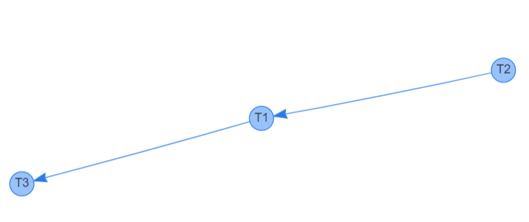

# Lec18 Exercise

20932780 Zhang Hexiao

### 4

##### a

Serializable: No. There is a cycle in the precedence graph T1 -> T2 -> T3 -> T1.

##### b

Serializable: Yes. The equivalent serial schedule is T1, T2.

Recoverable: Yes. T2 reads A from the write of T1 and commits after T1.

Cascadeless: No. T2 reads A from the write of T1 before T1.

##### c

Recoverable: Yes. No transaction reads items from the write of others.

Cascadeless: Yes. No transaction reads items from the write of others.

### 5

##### a

##### b

T2, T1, T3

#### c

r3(Z) w3(Z) r1(X) r2(Y) w2(Y) w1(X) r1(Y) r3(X) **c2 c1 c3**

##### d

r3(Z) w3(Z) r1(X) r2(Y) w2(Y) **c2** w1(X) r1(Y) **c1** r3(X)  **c3**